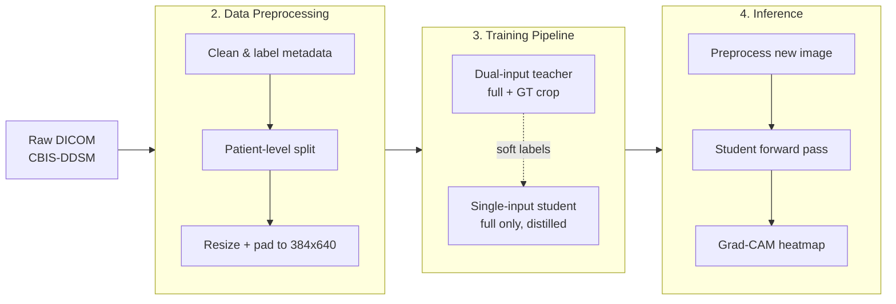

# System Design: Explainable Breast Cancer Classification from Mammograms

## 1. Overview

This document describes the design of a system that classifies full mammogram images as **benign** or **malignant** and explains each prediction with a **Grad-CAM** heatmap. It is built on the **CBIS-DDSM** dataset (Curated Breast Imaging Subset of the Digital Database for Screening Mammography) and trained with four convolutional backbones (DenseNet121, ResNet-50, EfficientNet-B2, VGG-16) so their accuracy and interpretability can be compared.

The central design constraint is **deployability**: at inference time, a radiologist (or any downstream user) will only ever have the full mammogram — not a hand-cropped lesion patch, not a segmentation mask. Any model that *requires* those extra inputs cannot be used in practice. The system is therefore built in two stages:

1. A **dual-input "teacher"** model that sees the full mammogram *and* a ground-truth crop of the lesion (available only in the training set, because CBIS-DDSM provides expert-annotated ROI crops). This model has access to more information than will ever be available at inference time, so it acts as an upper bound and as a source of soft labels.
2. A **single-input "student"** model that sees *only* the full mammogram, trained with **knowledge distillation** from the teacher. This is the model that is actually deployed and explained.

The pipeline has three stages, which map to the three sections of this document:



**Why this two-stage teacher/student design?** A model that also sees the cropped lesion has an easier job — the crop tells it *where to look*. Distillation lets the single-input student borrow some of that advantage during training (via the teacher's soft probability outputs) without needing the crop at inference time. The final report (`notebooks/experiment_1_baseline/results/final_report.md`) confirms this works: the deployable single-input DenseNet121 scores 0.7524 accuracy / 0.8390 AUC versus the non-deployable dual-input teacher's 0.7868 / 0.8655 — a gap that is **not** statistically significant (McNemar p = 0.254), meaning the crop can be dropped at inference for no detectable cost.

---

## 2. Data Preprocessing

### 2.1 Source data and labels

The raw dataset is **CBIS-DDSM**, distributed as DICOM images plus two metadata CSVs (`calc_case_description_*.csv` for calcifications, `mass_case_description_*.csv` for masses), each row describing one lesion: a `patient_id`, a `pathology` label, and relative paths to the full mammogram, a cropped lesion patch, and an ROI mask.

Labels are binarized, folding the CBIS-DDSM category `BENIGN_WITHOUT_CALLBACK` into plain `BENIGN`:

```python
raw_df['pathology'] = raw_df['pathology'].map({
    'BENIGN': 0,
    'MALIGNANT': 1,
    'BENIGN_WITHOUT_CALLBACK': 0,
})
```

### 2.2 Patient-level train/val/test split (leakage prevention)

A naive random split of *rows* is unsafe here: the same patient can contribute several images (both breasts, multiple views), so a row-level split can leak a patient's other images into the test set and inflate accuracy. Every split in this project is therefore grouped by `patient_id` using scikit-learn's group-aware splitters, so a given patient's images live entirely in one split:

```python
from sklearn.model_selection import StratifiedGroupKFold

# roughly 80/10/10 -> use ~10 folds, take 1 fold as test
sgkf = StratifiedGroupKFold(n_splits=10, shuffle=True, random_state=42)
trainval_idx, test_idx = next(sgkf.split(
    raw_df, y=raw_df['pathology'], groups=raw_df['patient_id']
))
trainval_df = raw_df.iloc[trainval_idx]
test_df     = raw_df.iloc[test_idx]

# repeat on trainval to carve out val (~10% of the original)
sgkf2 = StratifiedGroupKFold(n_splits=9, shuffle=True, random_state=42)
train_idx, val_idx = next(sgkf2.split(
    trainval_df, y=trainval_df['pathology'], groups=trainval_df['patient_id']
))
train_df = trainval_df.iloc[train_idx]
val_df   = trainval_df.iloc[val_idx]
```

`StratifiedGroupKFold` does two things at once: it groups by `patient_id` (no patient crosses a split boundary) **and** stratifies by the `pathology` label (benign/malignant proportions stay similar across splits, so a model can't get lucky/unlucky from an imbalanced test set). `random_state=42` is fixed everywhere in the project for reproducibility. An earlier version of the pipeline (`notebooks/data_cleaning.ipynb`) additionally re-checked for patient overlap between CBIS-DDSM's *own* published train/test CSVs and found leakage there too, which is why the splits are rebuilt from scratch rather than trusted as-is:

```python
train_patients = set(df['patient_id'])
test_patients  = set(test_df['patient_id'])
overlap = train_patients.intersection(test_patients)
df.drop(df[df['patient_id'].isin(overlap)].index, inplace=True)
```

### 2.3 Image caching: from DICOM to a fixed-size tensor-ready cache

Reading and decoding a DICOM file on every training step would make training I/O-bound, so images are converted **once** into a PNG cache sized to exactly what the model expects. The cache went through two resolutions over the course of the project, and the reasoning behind the change is itself a design decision worth documenting.

**Original cache (224×224, square).** Images were letterboxed into a square canvas: shrunk to fit (aspect ratio preserved) with high-quality Lanczos resampling, then centered on a black square canvas:

```python
def preprocess_image(image_path, size=(224, 224)):
    img = Image.open(image_path).convert("RGB")
    img.thumbnail(size, Image.Resampling.LANCZOS)
    canvas = Image.new("RGB", size, (0, 0, 0))
    offset = ((size[0] - img.width) // 2, (size[1] - img.height) // 2)
    canvas.paste(img, offset)
    return canvas
```

**Why this was changed.** At 224×224, the median lesion in CBIS-DDSM measures only about 19×10 pixels — smaller than a single cell of DenseNet121's final 7×7 feature grid. That is a hard ceiling on both classification accuracy (the network barely "sees" small lesions) and on Grad-CAM quality (a Grad-CAM heatmap's resolution *is* the resolution of that final feature grid, so a lesion smaller than one cell cannot be localized at all).

**Current cache (384×640, aspect-preserving).** The cache was rebuilt at a larger, *non-square* resolution matching the median mammogram's aspect ratio (mammograms are tall and narrow), which grows the median lesion to roughly 35×34 pixels — about 6× the pixel area — without distorting the image:

```python
TARGET_W, TARGET_H = 384, 640  # 0.60 aspect ratio, matches the median mammogram

def fit_pad(im, resample):
    """Scale to fit inside TARGET_W x TARGET_H preserving aspect ratio,
    then center on a black canvas of exactly that size."""
    w, h = im.size
    s = min(TARGET_W / w, TARGET_H / h)
    nw, nh = max(1, round(w * s)), max(1, round(h * s))
    canvas = Image.new("L", (TARGET_W, TARGET_H), 0)
    canvas.paste(im.resize((nw, nh), resample), ((TARGET_W - nw) // 2, (TARGET_H - nh) // 2))
    return canvas
```

The full mammogram is resized with `Image.LANCZOS` (smooth, good for photographic content); the ROI mask is resized with `Image.NEAREST` (no interpolation, so a binary mask stays binary instead of picking up gray "fuzz" at its edges). Both are passed through the *same* `fit_pad` geometry so the mammogram and its mask stay pixel-aligned — this alignment is what later lets Grad-CAM heatmaps be scored directly against the mask. No DICOM windowing or CLAHE contrast enhancement is applied; preprocessing is deliberately limited to geometric resizing so results reflect what a plain CNN backbone can do on the raw pixel intensities.

### 2.4 Resolving the ROI mask

CBIS-DDSM stores the lesion crop and its ROI mask as two same-named PNGs sitting in the same folder, without a reliable naming convention to tell them apart. The cleaning pipeline resolves this by process of elimination — after removing the known crop file, exactly one PNG should remain:

```python
def resolve_roi_mask(crop_rel_path):
    folder = PNG_ROOT / Path(crop_rel_path).parent
    pngs = list(folder.glob("*.png"))
    crop_basename = Path(crop_rel_path).name
    candidates = [p for p in pngs if p.name != crop_basename]
    if len(pngs) == 2 and len(candidates) == 1:
        return candidates[0]
    return None  # ambiguous folder contents -> drop the row rather than guess
```

Rows where no mask can be unambiguously resolved are dropped rather than guessed at, since a wrong mask would silently corrupt every downstream localization metric.

### 2.5 Preprocessing pipeline summary

| Stage | Notebook / script | Output |
|---|---|---|
| Load metadata, map labels, drop patient-overlap rows | `data_cleaning.ipynb` / `data_cleaning_three_input.ipynb` | cleaned dataframe |
| Resolve full / crop image paths on disk | `png_exists.ipynb` | `*_df_cleaned.csv` |
| Resolve ROI mask path, cache mask at target resolution | `roi_caching.ipynb` | `*_df_with_roi.csv` |
| Patient-grouped, label-stratified 80/10/10 split | (inside `data_cleaning_three_input.ipynb`) | `train/val/test_df.csv` |
| Cache full mammogram + mask at 384×640, aspect-preserved | `build_hires_cache.py` | `*_df_hires.csv` + PNG cache |

---

## 3. Training Pipeline

### 3.1 Model architecture

Four ImageNet-pretrained CNN backbones are compared under an identical training recipe: **DenseNet121**, **ResNet-50**, **EfficientNet-B2**, and **VGG-16**. Each is truncated *before* its original classification head so the network still outputs a spatial feature map (not a single pooled vector) — this is essential both for the custom classifier head below and for Grad-CAM, which needs a spatial map to compute a heatmap over:

```python
def build_backbone_spatial(arch, verify_hw):
    if arch == "densenet121":
        base = models.densenet121(weights=models.DenseNet121_Weights.IMAGENET1K_V1)
        extractor, dim = nn.Sequential(base.features, nn.ReLU(inplace=True)), 1024
    elif arch == "resnet50":
        base = models.resnet50(weights=models.ResNet50_Weights.IMAGENET1K_V2)
        # [:-2], not [:-1]: ResNet's own avgpool sits right before fc, so
        # dropping only the last layer still leaves a (B, 2048, 1, 1) tensor.
        extractor, dim = nn.Sequential(*list(base.children())[:-2]), 2048
    elif arch == "efficientnet_b2":
        base = models.efficientnet_b2(weights=models.EfficientNet_B2_Weights.IMAGENET1K_V1)
        extractor, dim = base.features, 1408
    elif arch == "vgg16":
        base = models.vgg16(weights=models.VGG16_Weights.IMAGENET1K_V1)
        extractor, dim = base.features, 512
    return extractor, dim
```

On top of the extractor sits a small classifier head fed by **global average pooling (GAP)** — averaging the spatial feature map down to one vector per channel, which is what makes the network resolution-agnostic and keeps the Grad-CAM formula simple:

```python
class SingleInputModel(nn.Module):
    """The deployable student: full mammogram in, class logits out."""

    def __init__(self, arch, num_classes=2, dropout=0.5):
        super().__init__()
        self.extractor, feat_dim = build_backbone_spatial(arch, verify_hw=(640, 384))
        self.avgpool = nn.AdaptiveAvgPool2d((1, 1))
        self.classifier = nn.Sequential(
            nn.Linear(feat_dim, 512), nn.ReLU(inplace=True), nn.Dropout(dropout),
            nn.Linear(512, 128),      nn.ReLU(inplace=True), nn.Dropout(dropout),
            nn.Linear(128, num_classes),
        )

    def forward(self, full_image):
        """Classification only. This is the inference path."""
        spatial = self.extractor(full_image)
        pooled = torch.flatten(self.avgpool(spatial), 1)
        return self.classifier(pooled)
```

### 3.2 Knowledge distillation

The **teacher** is a dual-input model (full mammogram + ground-truth lesion crop) trained separately and then frozen. The **student** is the `SingleInputModel` above. During student training, the teacher produces "soft labels" — a probability distribution over classes rather than a hard 0/1 — which carry more information than the ground-truth label alone (e.g. "85% malignant" says more than just "malignant"). The student loss blends ordinary cross-entropy against the true label with a KL-divergence term pulling the student's output distribution toward the teacher's:

```python
def distillation_loss(student_logits, teacher_logits, labels, temperature, alpha):
    hard = F.cross_entropy(student_logits, labels)
    if alpha <= 0.0:
        return hard
    soft_t = F.softmax(teacher_logits / temperature, dim=1)
    soft_s = F.log_softmax(student_logits / temperature, dim=1)
    soft = F.kl_div(soft_s, soft_t, reduction="batchmean") * (temperature ** 2)
    return alpha * soft + (1 - alpha) * hard
```

`temperature` (set to 4.0) "softens" both distributions before comparing them — dividing logits by a temperature > 1 spreads out the probabilities so the student can learn from the teacher's *relative* confidence between classes, not just its top pick. `alpha` (set to 0.5) is the mixing weight between the two loss terms, i.e. an equal split between "match the teacher" and "match the ground truth." This is the standard knowledge-distillation formulation (Hinton et al., 2015).

### 3.3 Data augmentation

Because the ROI mask must stay pixel-aligned with the mammogram (needed later for Grad-CAM validation and for an optional auxiliary segmentation loss), any *geometric* augmentation — flip, rotate — is applied identically to both the image and its mask using one shared random draw. *Photometric* augmentation (brightness/contrast) is applied to the image only, since it has no meaning for a binary mask:

```python
_color_jitter = transforms.ColorJitter(brightness=0.15, contrast=0.15)

def paired_geometric_augment(full_img, mask_img):
    """One random draw shared by image and mask, so they stay aligned."""
    if random.random() < 0.5:
        full_img, mask_img = TF.hflip(full_img), TF.hflip(mask_img)
    angle = transforms.RandomRotation.get_params([-15, 15])
    return TF.rotate(full_img, angle), TF.rotate(mask_img, angle)
```

### 3.4 Training loop: two-phase fine-tuning

Training happens in two phases per architecture, a common recipe for fine-tuning a pretrained network without destroying its pretrained weights early on:

- **Phase 1 — head warm-up (5 epochs).** The backbone is frozen; only the new classifier head is trained, with a relatively high learning rate (`1e-4`). This lets the randomly-initialized head start making sensible predictions before any gradient is allowed to touch the pretrained backbone.
- **Phase 2 — full fine-tune (up to 35 more epochs).** The backbone is unfrozen and trained with a *smaller* learning rate (`1e-5`, i.e. 10× lower than the head's `1e-4`) so pretrained ImageNet features are nudged gently rather than overwritten. A `ReduceLROnPlateau` scheduler halves... (factor 0.1) the learning rate when validation loss stalls for 5 epochs, and training stops early if validation loss hasn't improved for 8 epochs.

```python
model.set_backbone_trainable(False)
optimizer = optim.AdamW(filter(lambda p: p.requires_grad, model.parameters()),
                         lr=BASELINE["head_lr"], weight_decay=BASELINE["weight_decay"])

for phase in (1, 2):
    if phase == 2:
        model.set_backbone_trainable(True)
        optimizer = optim.AdamW([
            {"params": model.extractor.parameters(), "lr": BASELINE["backbone_lr"]},
            {"params": model.head_parameters(),       "lr": BASELINE["head_lr"]},
        ], weight_decay=BASELINE["weight_decay"])
        sched = optim.lr_scheduler.ReduceLROnPlateau(optimizer, mode="min", factor=0.1, patience=5)

    for _ in range(n_warm if phase == 1 else MAX_EPOCHS - n_warm):
        epoch += 1
        train_loss, _ = run_epoch(model, train_loader, ..., optimizer, desc="train")
        val_loss, val_metrics = run_epoch(model, val_loader, ..., desc="val")
        if phase == 2:
            sched.step(val_loss)
        if val_loss < best_loss:
            best_loss, bad = val_loss, 0
            torch.save({"model_state_dict": model.state_dict(), "arch": arch, ...}, ckpt_path)
        elif phase == 2:
            bad += 1
            if bad >= EARLY_STOPPING_PATIENCE:
                break
```

**Key hyperparameters** (identical across all four architectures for a fair comparison):

| Parameter | Value | Rationale |
|---|---|---|
| Input resolution | 384 × 640 | see §2.3 |
| Batch size | 8 | at 384×640, each image is ~5× the pixels of the old 224² cache; a larger batch would exceed GPU memory |
| Head LR / backbone LR | 1e-4 / 1e-5 | discriminative fine-tuning — protect pretrained features |
| Weight decay | 1e-4 | L2 regularization |
| LR scheduler | `ReduceLROnPlateau` (factor 0.1, patience 5) | phase 2 only |
| Head warm-up | 5 epochs | |
| Max epochs | 40 | |
| Early stopping patience | 8 epochs | phase 2 only, on validation loss |
| Distillation temperature / alpha | 4.0 / 0.5 | standard Hinton et al. recipe |
| Random seed | 42 | reproducibility across `random`, `numpy`, and `torch` (CPU + all CUDA devices) |

```python
def set_seed(seed=42):
    random.seed(seed)
    np.random.seed(seed)
    torch.manual_seed(seed)
    if torch.cuda.is_available():
        torch.cuda.manual_seed_all(seed)
```

### 3.5 Hyperparameter search

Before the final architecture comparison, a separate 6-phase sequential search (`hyperparameter_tuning.ipynb`) tuned the dual-input DenseNet121 teacher one axis at a time, each phase fixing the previous phase's winner before moving on: **(1)** learning rate, **(2)** weight decay, **(3)** LR scheduler family (plateau vs. cosine vs. one-cycle), **(4)** augmentation strength, **(5)** class-imbalance handling (unweighted vs. class-weighted cross-entropy vs. focal loss), **(6)** optimizer (AdamW vs. Adam vs. SGD+momentum). The winning combination from all six phases was retrained from scratch and evaluated on the held-out test split; a 4-view test-time augmentation (TTA) pass was applied on top as a final accuracy improvement.

---

## 4. Inference and Explainability

### 4.1 End-to-end inference

At inference time, only the full mammogram is available — no crop, no mask. The image is converted to grayscale, resized/padded with the exact same geometry used to build the training cache (so the model never sees a distribution shift between training and deployment), expanded to 3 channels, and normalized with ImageNet statistics:

```python
def preprocess(pil_gray):
    """Raw PIL image -> (1, 3, 640, 384) normalized tensor,
    identical geometry to the training cache builder."""
    canvas = fit_pad(pil_gray, Image.LANCZOS)
    t = TF.to_tensor(canvas)
    return TF.normalize(t.expand(3, -1, -1).clone(), IMAGENET_MEAN, IMAGENET_STD).unsqueeze(0)


def explain(image_path, cam_fn, class_idx=1):
    """The production inference call.

    Returns (prob_malignant, heatmap), where heatmap has the shape of the
    ORIGINAL image the caller supplied -- not the internal 384x640 size.
    """
    with Image.open(image_path) as im:
        pil = im.convert("L")
        ow, oh = pil.size
        x = preprocess(pil).to(DEVICE)
    cam, probs = cam_fn(x, class_idx=class_idx)
    return float(probs[0, 1]), cam_to_original(cam[0], ow, oh)
```

`class_idx` is pinned to `1` (malignant) rather than following the model's own top prediction, so that benign and malignant cases both get explained with respect to the *same* class — otherwise a benign case's heatmap would show "what looks benign," which is a different (and less clinically useful) question than "does anything here look malignant."

### 4.2 Grad-CAM

Explanations are produced with **Grad-CAM** (Selvaraju et al., 2017), implemented from scratch with forward/backward hooks on the backbone's final spatial feature map — the same `extractor` output used for GAP pooling during training, so the explanation is computed over exactly the features the classifier actually used:

```python
class GradCAM:
    """Grad-CAM on SingleInputModel.extractor, via hooks so the model is untouched."""

    def __init__(self, model, target_layer=None):
        self.model = model
        self.layer = target_layer or model.extractor
        self._act = self._grad = self._handle = None

    def __enter__(self):
        def fwd_hook(_m, _i, out):
            self._act = out
            if out.requires_grad:
                out.register_hook(lambda g: setattr(self, "_grad", g))
        self._handle = self.layer.register_forward_hook(fwd_hook)
        return self

    def __call__(self, x, class_idx=1, out_hw=(640, 384)):
        """Returns (cam[B,H,W] in [0,1], probs[B,2])."""
        self.model.eval()
        with torch.enable_grad():
            x = x.detach().clone().requires_grad_(True)
            logits = self.model(x)
            probs = torch.softmax(logits, dim=1).detach()
            self.model.zero_grad(set_to_none=True)
            logits[:, class_idx].sum().backward()

            # Grad-CAM formula: weight each feature channel by its average
            # gradient, sum, and keep only the positive (class-supporting) signal.
            w = self._grad.mean(dim=(2, 3), keepdim=True)
            cam = F.relu((w * self._act).sum(dim=1, keepdim=True))
            cam = F.interpolate(cam, size=out_hw, mode="bilinear", align_corners=False)[:, 0]
            cam = cam / cam.amax(dim=(1, 2), keepdim=True).clamp_min(1e-12)
        return cam.detach().cpu().numpy(), probs.cpu().numpy()
```

In plain terms: Grad-CAM asks *"which spatial locations in the last feature map, if increased, would most increase the malignant-class score?"* It answers this by backpropagating the malignant logit down to the feature map, averaging each channel's gradient into a single importance weight, and using those weights to combine the feature channels into one heatmap. `ReLU` discards locations that would *decrease* the malignant score (only positive evidence is shown), and the result is upsampled from the small feature-map resolution back up to the model's 384×640 input size.

Because the model's input was padded to a fixed aspect ratio (§2.3), the heatmap is mapped back to the *original* image's resolution by inverting that exact padding geometry, cropping out the black border and resizing the remaining core back up:

```python
def cam_to_original(cam, orig_w, orig_h, tw=384, th=640):
    """Map a (th, tw) heatmap back to the caller's original resolution."""
    s = min(tw / orig_w, th / orig_h)
    nw, nh = round(orig_w * s), round(orig_h * s)
    ox, oy = (tw - nw) // 2, (th - nh) // 2
    core = cam[oy:oy + nh, ox:ox + nw]
    return np.array(Image.fromarray(core, mode="F").resize((orig_w, orig_h), Image.BILINEAR))
```

### 4.3 Validating explanations against ground truth

Because CBIS-DDSM provides expert ROI masks, Grad-CAM's quality can be measured quantitatively rather than judged by eye: does the heatmap's "hot" region actually overlap the lesion? All metrics are restricted to the non-padded region of the canvas (the black padding introduced in §2.3 is excluded, since a heatmap peak landing on padding is meaningless and would otherwise distort the scores):

```python
def localization_metrics(cam, mask, valid, tolerance_px=15):
    out = {}

    # Pointing game: does the single hottest pixel fall inside the lesion mask?
    masked = np.where(valid, cam, -np.inf)
    py, px = np.unravel_index(np.argmax(masked), masked.shape)
    out["pointing_hit"] = bool(mask[py, px])

    ys, xs = np.nonzero(mask)
    out["peak_dist_px"] = float(np.min(np.hypot(ys - py, xs - px)))
    out["pointing_hit_tol"] = out["peak_dist_px"] <= tolerance_px

    # Energy concentration: what fraction of the heatmap's total "mass"
    # falls inside the lesion mask? (threshold-free, the headline metric)
    denom = cam[valid].sum()
    out["energy_concentration"] = float(cam[mask & valid].sum() / denom)

    # Concentration ratio: energy concentration relative to what you'd expect
    # from a heatmap that ignored the image entirely (chance = mask area / valid area).
    chance = mask[valid].sum() / valid.sum()
    out["concentration_ratio"] = out["energy_concentration"] / chance

    # Pixel-level AP / AUROC: treat the heatmap as a per-pixel malignancy score
    # and the mask as ground truth.
    out["pixel_ap"] = float(average_precision_score(mask[valid], cam[valid]))
    out["pixel_auroc"] = float(roc_auc_score(mask[valid], cam[valid]))
    return out
```

The **concentration ratio** is the primary metric: a value of, say, 3.0 means the heatmap puts three times more of its attention on the lesion than a heatmap that ignored the image and just guessed randomly would. As a sanity check, the same metrics are computed for an **untrained, randomly-initialized** model — it should (and does) score close to a ratio of 1.0×, confirming the metric measures something the *trained* model learned, not an artifact of the dataset's geometry.

Architectures are ranked on this metric using a paired, non-parametric **Wilcoxon signed-rank test** across all six pairs of the four backbones, with **Holm–Bonferroni correction** for the multiple comparisons — standard practice to avoid inflating the false-positive rate from testing six hypotheses at once.

---

## 5. Results Summary

Evaluated on an identical, held-out 319-row test split (never seen during training of either model):

| Architecture | Single-input accuracy [95% CI] | AUC [95% CI] | vs. dual-input teacher (McNemar p) |
|---|---|---|---|
| **DenseNet121** | **0.7524** [0.705–0.799] | **0.8390** [0.796–0.879] | p = 0.254 (not significant) |
| VGG-16 | 0.7273 [0.677–0.774] | 0.8328 [0.789–0.873] | p = 0.445 (not significant) |
| EfficientNet-B2 | 0.7147 [0.664–0.765] | 0.8133 [0.767–0.858] | p = 0.064 (not significant) |
| ResNet-50 | 0.7022 [0.652–0.749] | 0.7939 [0.744–0.840] | p = 0.598 (not significant) |

**DenseNet121** is the best-performing deployable (single-input) model. For every architecture, the accuracy gap to its non-deployable dual-input teacher is *not* statistically significant at this sample size — the core deployability claim of this thesis: giving up the ground-truth lesion crop at inference time costs nothing detectable.

---

## 6. Design Decisions and Limitations

- **No DICOM windowing/CLAHE.** Preprocessing is limited to geometric resizing (§2.3); results reflect a plain CNN backbone on raw pixel intensities, not a radiology-specific contrast pipeline. This is a possible avenue for future accuracy gains.
- **Grad-CAM, not a newer CAM variant.** Grad-CAM was chosen for its simplicity and its use of only one backward pass, which keeps the inference-time explanation cheap. Variants such as Grad-CAM++ or Score-CAM were not evaluated.
- **Fixed 384×640 canvas.** Chosen to match the median mammogram aspect ratio and to make the median lesion large enough to be visible in the final feature map (§2.3); very wide or unusually-shaped mammograms are still padded, which slightly wastes feature-map capacity on black border pixels — excluded from localization scoring via the `valid` mask.
- **Distillation is offline (precomputed teacher logits) in the final hi-res pipeline**, versus online (teacher run every batch) in the earlier 224px ablation — an efficiency change with no effect on the loss formula itself.
