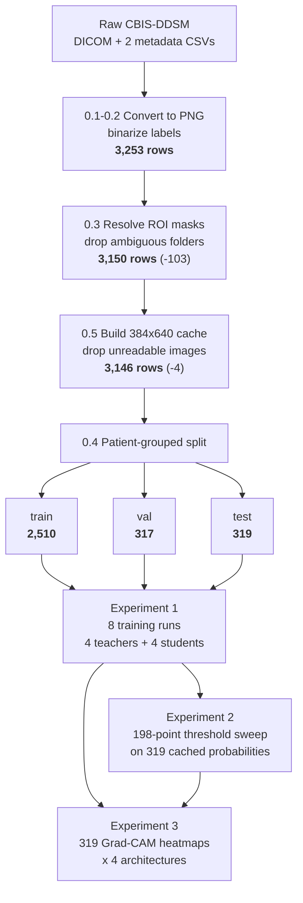

# Data Visualization

This document is the visual companion to the Data Gathering Procedure. Where that document describes *what is done* at each step, this one shows *what the data looks like* after each step: its volume, its shape, its schema, and how much of it survives.

Every count, dimension, and distribution below is read directly from the saved files in `dataframes/`, `models/`, and each experiment's `results/` directory. Nothing is estimated.

---

## Pipeline at a Glance



---

## Stage 0.1 — Raw Acquisition

**What arrives.** DICOM image folders plus two metadata CSVs. Each CSV row describes one abnormality.

**Folder naming pattern** — the label, split, patient, laterality, and view are all encoded in the directory name:

```
Calc-Training_P_00007_LEFT_CC/1.3.6.1.4.1.9590.100.1.2.20132232511369496261988
└──┬─┘ └──┬───┘ └──┬──┘ └─┬┘ └┤                    │
   │      │        │      │   └─ view (CC or MLO)  └─ DICOM UID (deeply nested)
   │      │        │      └───── laterality
   │      │        └──────────── patient ID
   │      └───────────────────── CBIS-DDSM's own split
   └──────────────────────────── abnormality type (Calc or Mass)
```

**Metadata columns retained** from the source CSVs:

| Column | Type | Purpose |
|---|---|---|
| `patient_id` | string (`P_00007`) | Grouping key for the leak-free split (§0.4) |
| `pathology` | categorical, 3 levels | Becomes the binary target (§0.2) |
| `image file path` | relative path | Full mammogram |
| `cropped image file path` | relative path | Expert lesion crop — teacher input only |
| *(mask path)* | resolved, not given | Derived in §0.3 |

---

## Stage 0.2 — Label Binarization

Three source categories collapse to two classes:

| CBIS-DDSM `pathology` | Mapped to | Class |
|---|---|---|
| `MALIGNANT` | 1 | Malignant |
| `BENIGN` | 0 | Benign |
| `BENIGN_WITHOUT_CALLBACK` | 0 | Benign |

**Resulting class balance** across the final 3,146 rows:

```
Benign     1,833  ████████████████████████████████████  58.3%
Malignant  1,313  ██████████████████████████            41.7%
```

The dataset is mildly imbalanced but not severely so — the majority-class baseline is 58.3% accuracy, which is the floor every model in Experiment 1 must clear to be worth anything.

---

## Stage 0.3 — ROI Mask Resolution

**The ambiguity.** CBIS-DDSM places the lesion crop and the ROI mask in the same folder, identically named, with no convention to distinguish them:

```
<crop folder>/
  ├── 1.3.6.1.4.1.9590.100.1.2.4212...png     ← which is the crop?
  └── 1.3.6.1.4.1.9590.100.1.2.9981...png     ← which is the mask?
```

**Resolution by elimination.** The crop's filename is known from the metadata CSV. Remove it; exactly one PNG should remain, and that is the mask. If the folder does not contain exactly two PNGs, or if elimination leaves more than one candidate, **the row is dropped** rather than guessed at.

**Attrition at this stage:**

| | Rows before | Rows after | Dropped |
|---|---|---|---|
| train | 2,599 | 2,513 | 86 |
| val | 328 | 317 | 11 |
| test | 326 | 320 | 6 |
| **Total** | **3,253** | **3,150** | **103 (3.2%)** |

---

## Stage 0.4 — Patient-Grouped Split

**Final split composition:**

| Split | Images | Patients | Benign | Malignant | % Malignant | Calc | Mass |
|---|---|---|---|---|---|---|---|
| Train | 2,510 | 1,110 | 1,468 | 1,042 | 41.5% | 1,237 | 1,273 |
| Validation | 317 | 144 | 184 | 133 | 42.0% | 166 | 151 |
| **Test** | **319** | **142** | **181** | **138** | **43.3%** | 161 | 158 |
| **Total** | **3,146** | **1,396** | **1,833** | **1,313** | **41.7%** | | |

**Proportions hold across splits** — stratification working as intended:

```
              benign                          malignant
train    ████████████████████████ 58.5%  ████████████████ 41.5%
val      ████████████████████████ 58.0%  ████████████████ 42.0%
test     ███████████████████████  56.7%  █████████████████ 43.3%
```

**Why grouping matters, visually.** 3,146 images come from only 1,396 patients — an average of **2.25 images per patient**. A row-level random split would scatter those siblings across boundaries:

```
WITHOUT grouping                    WITH grouping (StratifiedGroupKFold)
P_00123 LEFT_CC   → train           P_00123 LEFT_CC   → train
P_00123 LEFT_MLO  → TEST  ✗ leak    P_00123 LEFT_MLO  → train  ✓
P_00123 RIGHT_CC  → train           P_00123 RIGHT_CC  → train  ✓
```

**Leakage verification** — patient ID set intersections, computed from the saved split files:

| Pair | Shared patients |
|---|---|
| train ∩ test | **0** |
| train ∩ val | **0** |
| val ∩ test | **0** |

---

## Stage 0.5 — Image Preprocessing and Caching

**Geometry.** Each mammogram is scaled to fit inside 384 × 640 with aspect ratio preserved, then centered on a black canvas:

```
   original                          cached 384 x 640
  3024 x 5063                       ┌─────────────────┐  ← black padding
  ┌───────────┐                     │ ███████████████ │
  │           │                     │ ███████████████ │
  │  breast   │   ──fit_pad()──►    │ ██ mammogram ██ │  ← scaled core,
  │  tissue   │    scale 0.1264     │ ███████████████ │    aspect preserved
  │           │                     │ ███████████████ │
  └───────────┘                     │                 │  ← black padding
                                    └─────────────────┘
                                     7-12% of pixels are padding
                                     and are excluded from all
                                     Experiment 3 metrics
```

**Resampling differs by content type** — this is deliberate:

| Input | Filter | Why |
|---|---|---|
| Full mammogram | `LANCZOS` | Smooth, high quality for continuous-tone imagery |
| ROI mask | `NEAREST` | No interpolation, so a binary mask stays strictly 0/1 instead of gaining gray edges |

Both pass through **identical** padding geometry, which is what keeps mammogram and mask pixel-aligned.

**Why 384 × 640 and not 224 × 224** — measured lesion size in each cache:

| Cache | Median lesion (bbox) | Feature grid | Lesion vs. one grid cell |
|---|---|---|---|
| 224 × 224 (rejected) | ~19 × 10 px | 7 × 7 (cell = 32 px) | **smaller than one cell** |
| **384 × 640 (current)** | **35 × 34 px** | 20 × 12 (cell = 32 px) | **about one cell** |

The 35 × 34 figure is measured across all 319 test masks; the spread is wide (10th percentile 15 × 14 px, 90th percentile 87 × 80 px). Median lesion coverage is **0.31%** of the canvas, mean **1.05%** — which is the chance floor every Experiment 3 metric must be read against.

**Tensor shape progression, one image:**

```
DICOM file            →  PNG            →  cached PNG      →  model input
(variable, ~15 MP)       (3024 x 5063)     (384 x 640, L)     (1, 3, 640, 384) float32
                                                              normalized, ImageNet stats
```

**Row schema after caching** — `*_df_hires.csv`, 9 columns:

| Column | Content |
|---|---|
| `patient_id` | Grouping key |
| `pathology` | Binary target (0/1) |
| `image file path` | Original full mammogram (relative) |
| `cropped image file path` | Original lesion crop (relative) |
| `full image cached path` | 224² cache — teacher input |
| `cropped image cached path` | 224² crop cache — teacher input |
| `roi mask cached path` | 224² mask cache |
| `full hires cached path` | **384×640 cache — student input** |
| `roi hires cached path` | **384×640 mask — Experiment 3 ground truth** |

---

## Stage 0.6 — Data Augmentation

Applied to the **training split only**. The critical property is that geometric transforms use one shared random draw across image and mask:

| Transform | Applied to image | Applied to mask | Shared draw |
|---|---|---|---|
| Horizontal flip (p = 0.5) | Yes | **Yes** | **Yes** — must stay aligned |
| Rotation (±15°) | Yes | **Yes** | **Yes** — must stay aligned |
| Brightness jitter (±0.15) | Yes | No | — meaningless for a binary mask |
| Contrast jitter (±0.15) | Yes | No | — meaningless for a binary mask |

```
        image                mask              image                mask
      ┌───────┐           ┌───────┐          ┌───────┐           ┌───────┐
      │  ◕    │           │  ●    │   flip   │    ◕  │           │    ●  │
      │       │           │       │  ──────► │       │           │       │
      └───────┘           └───────┘   SAME   └───────┘           └───────┘
                                      draw        aligned ✓
```

**Split-level augmentation policy:**

| Split | Augmented |
|---|---|
| Train (2,510) | Yes |
| Validation (317) | No |
| Test (319) | No |

---

## Cumulative Attrition

| Stage | Rows | Δ | Cause |
|---|---|---|---|
| After PNG conversion + labeling | 3,253 | — | |
| After ROI mask resolution (§0.3) | 3,150 | −103 | Ambiguous mask folders |
| After hi-res caching (§0.5) | 3,146 | −4 | Unreadable or unresolvable images |
| **Retained** | **3,146** | **−107 (−3.3%)** | |

---

## Experiment 1 — Data In, Data Out

**Inputs consumed:**

| Artifact | Shape / volume |
|---|---|
| Train images (384×640) | 2,510 |
| Validation images | 317 |
| Test images | 319 |
| Teacher soft labels | 4 files, one per architecture |

**Teacher logit cache** — `dataframes/teacher_logits/teacher_logits_{arch}.npz`, one file per architecture:

```
teacher_logits_densenet121.npz
  train  (2510, 2)  float32
  val    ( 317, 2)  float32
  test   ( 319, 2)  float32
         └──┬──┘ └┬┘
            │     └─ two logits: [benign, malignant]
            └─────── one row per IMAGE, fixed across all epochs

  example row: [-1.1645, +0.9282]  →  softmax  →  89.0% malignant
                                     →  T=4.0   →  62.8% (softened target)
```

**Outputs produced:**

| Artifact | Count | Shape / size |
|---|---|---|
| Teacher checkpoints | 4 | `stage0_baseline_{arch}.pth` |
| **Student checkpoints** | **4** | `models/v4_hires_control_gap/*.pth`, 29–99 MB each |
| Cached test probabilities | 4 | `testprobs_*.npz` → `probs (319,)`, `labels (319,)` |
| Per-epoch training history | 4 | `history_*.csv`, 18–28 rows each |
| Run summary | 1 | `hires_runs.csv`, 4 rows × 22 columns |
| Comparison figures | 2 | PNG |

**Per-epoch history schema** — what the loss/accuracy curves are drawn from:

```
epoch │ train_loss │ val_loss │ train_acc │ val_acc │ val_auc │ lr
──────┼────────────┼──────────┼───────────┼─────────┼─────────┼──────
  1   │    ...     │   ...    │    ...    │   ...   │   ...   │ 1e-4   ← Phase 1
 ...  │            │          │           │         │         │          (frozen)
  5   │            │          │           │         │         │
  6   │            │          │           │         │         │ 1e-5   ← Phase 2
 ...  │            │          │           │         │         │          (unfrozen)
 19   │            │          │  ← best epoch, checkpoint saved
 ...  │            │          │
 27   │            │          │  ← early stop (8 epochs without improvement)
```

Training length varied by architecture: VGG-16 stopped at epoch 18 (best 10), DenseNet121 at 27 (best 19), EfficientNet-B2 at 25 (best 17), ResNet-50 at 28 (best 20).

---

## Experiment 2 — Data In, Data Out

**Input: a single 319-element vector.** No images, no GPU, no inference.

```
testprobs_hires_control_gap_a0.5_densenet121.npz
  probs   (319,)  float32   [0.6449, 0.4694, 0.6483, 0.0622, ...]
  labels  (319,)  int64     [     1,      1,      0,      0, ...]
```

**Processing: the same vector re-read 198 times.**

```
  t = 0.010  →  ŷ = (probs >= 0.010)  →  confusion matrix  →  Acc, Sens, Spec, F1
  t = 0.015  →  ŷ = (probs >= 0.015)  →  confusion matrix  →  Acc, Sens, Spec, F1
     ...                          198 rows total                    ...
  t = 0.995  →  ŷ = (probs >= 0.995)  →  confusion matrix  →  Acc, Sens, Spec, F1
```

**Output: a 198 × 5 sweep table**, from which two rows are selected by rule:

| Output file | Shape | Content |
|---|---|---|
| `sensitivity_threshold_sweep.csv` | 198 × 5 | The full sweep |
| `sensitivity_threshold_candidates.csv` | 2 rows | Crossover (t = 0.485), High-Sensitivity (t = 0.305) |
| `sensitivity_threshold_report_table.csv` | 3 rows | Main / Crossover / High-Sensitivity with CIs |
| Re-thresholded checkpoints | 2 | 29.4 MB each — **identical weights**, differing only in a `decision_threshold` field |

**What changes and what does not:**

```
                Main       Crossover   High-Sens
threshold       0.500      0.485       0.305      ← the ONLY thing that moves
model weights   identical  identical   identical  ← verified tensor-by-tensor
probabilities   identical  identical   identical  ← same 319-vector
AUC-ROC         0.8390     0.8390      0.8390     ← invariant by construction
sensitivity     0.7246     0.7464      0.9130     ← what the change buys
specificity     0.7735     0.7403      0.6464     ← what it costs
```

---

## Experiment 3 — Data In, Data Out

**Inputs consumed, per architecture:**

| Artifact | Shape |
|---|---|
| Test images (384×640) | 319 |
| ROI masks (384×640, binary) | 319, pixel-aligned with the above |
| Validity masks | 319, computed per image from original dimensions |
| Student checkpoint | 1 |

**Per-image processing:**

```
cached image (1,3,640,384)
      │
      ├─► forward pass ──► logits ──► prob_malignant
      │                       │
      │                       └─► backward pass on class 1
      │                                │
      └─────────────────────────► Grad-CAM ──► (20 x 12 grid)
                                                    │
                                          bilinear upsample
                                                    │
                                              (640, 384) in [0,1], peak = 1.0
                                                    │
                              ┌─────────────────────┼──────────────────────┐
                         pointing game         threshold at tau      threshold-free
                        (argmax vs mask)      (IoU, Dice x 19 taus)   (energy, ratio,
                                                                       pixel AP/AUROC)
```

**Output: one row per image, per architecture** — `localization_single_{arch}.csv`, **319 rows × 50 columns**:

| Column group | Count | Content |
|---|---|---|
| Pointing game | 4 | `pointing_hit`, `peak_dist_px`, `pointing_hit_tol`, `peak_in_padding` |
| Threshold-free | 5 | `energy_concentration`, `chance_rate`, `concentration_ratio`, `pixel_ap`, `pixel_auroc` |
| IoU / Dice sweep | 38 | `iou@0.05` … `iou@0.95`, `dice@0.05` … `dice@0.95` (19 τ values × 2) |
| Bookkeeping | 3 | `row_idx`, `prob_malignant`, `label` |

`row_idx` is what makes the four architectures' frames **paired** — all four evaluate the same images in the same order, asserted programmatically before any test is run.

**Aggregate outputs:**

| File | Shape | Content |
|---|---|---|
| `localization_single_{arch}.csv` | 4 × (319 × 50) | Per-image raw scores |
| `localization_headline_single_all_archs.csv` | 4 × 12 | Headline metrics with CIs |
| `interpretability_pairwise.csv` | 18 rows | 6 pairs × 3 metrics, Holm-adjusted |
| `interpretability_rank_agreement.csv` | 4 × 9 | Rank per metric + mean rank |
| `threshold_sweep_val_single.csv` | 76 rows | 4 archs × 19 τ values |
| Grad-CAM overlay grids | 40 PNGs | 10 batches × 4 architectures |

---

## Total Data Volume

| Category | Volume |
|---|---|
| Source rows retained | 3,146 images from 1,396 patients |
| Cached PNGs | 6,292 files (3,146 mammograms + 3,146 masks) at 384 × 640 |
| Models trained | 8 (4 teachers + 4 students) |
| Shipped model checkpoints | 4, in `models/v4_hires_control_gap/` (~224 MB total) |
| Test-set predictions cached | 4 × 319 probabilities |
| Threshold evaluations | 198 cutoffs × 4 metrics |
| Grad-CAM heatmaps generated | 1,276 (319 images × 4 architectures) |
| Per-image localization scores | 63,800 values (319 × 50 × 4) |
| Bootstrap resamples drawn | > 100,000 across all reported intervals |
