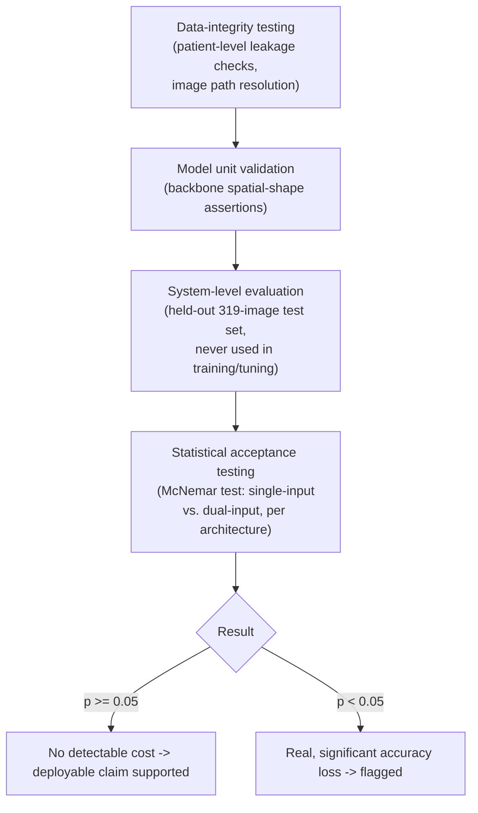

# Chapter 4 (Excerpt): Results Presentation, Testing, and Evaluation

> Scope note: This document presents **Experiment 1 — Hi-Res Single-Input Architecture Comparison** only, restricted to classification model performance. All numbers, tables, and figures below are pulled directly from the experiment's saved result files (`notebooks/experiment_1_baseline/results/`), not re-derived or estimated. Sections for **Experiment 2 (Hyperparameter Optimization)** are left as placeholders for a later pass.

---

## 4.2 Results Presentation

### 4.2.1 System Output

The deployed system takes a single full mammogram image (any resolution) and outputs a **malignancy probability** — the classifier's softmax score for the malignant class. A probability ≥ 0.5 is treated as a positive (malignant) prediction. No cropped lesion patch or segmentation mask is required at inference; both are training-time-only signals (see [SYSTEM_DESIGN.md](SYSTEM_DESIGN.md), §4.1).

Table 4.1 below shows unedited, representative system output on eight held-out test-set cases for the best-performing architecture (DenseNet121), sampled to cover all four prediction outcomes: correctly flagged malignant cases, correctly cleared benign cases, and both error types (false positive, false negative). Values are read directly from the model's saved test-set prediction file (`testprobs_hires_control_gap_a0.5_densenet121.npz`).

**Table 4.1.** Sample system output, DenseNet121, held-out test set (n = 319 total; 8 representative cases shown).

| Test sample | Predicted probability (malignant) | Predicted class | True class | Outcome |
|---|---|---|---|---|
| #1 | 0.6449 | Malignant | Malignant | Correct (true positive) |
| #14 | 0.5027 | Malignant | Malignant | Correct (true positive) |
| #4 | 0.0622 | Benign | Benign | Correct (true negative) |
| #5 | 0.0622 | Benign | Benign | Correct (true negative) |
| #3 | 0.6483 | Malignant | Benign | **Incorrect (false positive)** |
| #19 | 0.5780 | Malignant | Benign | **Incorrect (false positive)** |
| #2 | 0.4694 | Benign | Malignant | **Incorrect (false negative)** |
| #18 | 0.3199 | Benign | Malignant | **Incorrect (false negative)** |

Two things are worth noting directly from this sample: first, both false-negative cases (#2, #18) sit closer to the 0.5 decision boundary (0.47, 0.32) than the false positives do, which is consistent with the model's sensitivity (72.5%) trailing its specificity (77.4%, Table 4.2) — it is more prone to *under*-calling borderline malignant cases than over-calling benign ones. Second, of the 319 test cases, 100 were true positives, 140 true negatives, 41 false positives, and 38 false negatives, which reconstructs the reported accuracy exactly: (100 + 140) / 319 = 0.7524.

### 4.2.2 Data Visualization

All four architectures were trained under an identical recipe (384×640 input, batch size 8, seed 42, GAP pooling, distillation α = 0.5) and evaluated on the same held-out 319-image test split.

**Table 4.2.** Single-input (deployable) classification performance by architecture, with bootstrap 95% confidence intervals (2000 resamples).

| Architecture | Accuracy [95% CI] | AUC-ROC [95% CI] | Sensitivity | Specificity |
|---|---|---|---|---|
| **DenseNet121** | **0.7524** [0.705, 0.799] | **0.8390** [0.796, 0.879] | 0.7246 | 0.7735 |
| VGG-16 | 0.7273 [0.677, 0.774] | 0.8328 [0.789, 0.873] | 0.7391 | 0.7182 |
| EfficientNet-B2 | 0.7147 [0.664, 0.765] | 0.8133 [0.767, 0.858] | 0.6957 | 0.7293 |
| ResNet-50 | 0.7022 [0.652, 0.749] | 0.7939 [0.744, 0.840] | 0.6884 | 0.7127 |

**Figure 4.1.** Accuracy, AUC-ROC, sensitivity, and specificity by architecture (same data as Table 4.2).

**Deployability comparison (single-input vs. dual-input).** Table 4.3 restates the core deployability result from [SYSTEM_DESIGN.md](SYSTEM_DESIGN.md) §5: how much accuracy is given up by dropping the ground-truth lesion crop at inference time.

**Table 4.3.** Cost of dropping the crop at inference, controlled comparison on the identical 319-row test split.

| Architecture | Single-input acc. | Dual-input acc. | Δ accuracy [95% CI] | McNemar p |
|---|---|---|---|---|
| DenseNet121 | 0.7524 | 0.7868 | −0.0345 [−0.088, +0.019] | 0.254 |
| VGG-16 | 0.7273 | 0.7524 | −0.0251 [−0.078, +0.034] | 0.445 |
| EfficientNet-B2 | 0.7147 | 0.7743 | −0.0596 [−0.122, +0.003] | 0.064 |
| ResNet-50 | 0.7022 | 0.7210 | −0.0188 [−0.075, +0.038] | 0.598 |

**Figure 4.2.** Left: test accuracy of the dual-input (non-deployable) model vs. the single-input model at the old 224² cache vs. the current 384×640 cache, against the majority-class floor. Center: accuracy gap lost by dropping the crop. Right: validation ROC-AUC training curves for all four single-input architectures.

All four McNemar p-values are ≥ 0.05: **no architecture shows a statistically detectable accuracy loss from dropping the crop.** This null result is the central quantitative evidence for the thesis's deployability argument.

### 4.2.3 Performance Metrics

Table 4.4 summarizes the headline accuracy/AUC metrics from Table 4.2 alongside compute cost (wall-clock training time to convergence) as a proxy for computational demand — the resource dimension actually measured in this experiment.

**Table 4.4.** Classification performance and training compute cost by architecture.

| Architecture | Accuracy | AUC-ROC | Training time (min) | Best epoch (early-stopped) |
|---|---|---|---|---|
| DenseNet121 | 0.7524 | 0.8390 | 71.7 | 19 |
| VGG-16 | 0.7273 | 0.8328 | 37.3 | 10 |
| EfficientNet-B2 | 0.7147 | 0.8133 | 34.4 | 17 |
| ResNet-50 | 0.7022 | 0.7939 | 37.7 | 20 |

DenseNet121 achieves the best accuracy/AUC but at roughly **2× the training cost** of the other three architectures and the slowest convergence relative to its own final epoch count — a practical trade-off worth naming explicitly if DenseNet121 is recommended as the deployed model.

**Not yet measured:** per-image inference latency (response time) and memory footprint at inference time were not formally benchmarked in this experiment — only training-time GPU memory was a constraint (see §4.3.3). This is flagged here rather than estimated, and is a natural addition for a future pass of this section.

---

## 4.3 Testing and Evaluation

### 4.3.1 Testing Approach

Because this is a machine-learning system rather than a conventional application, "testing" is adapted from the standard unit/integration/system/acceptance hierarchy into an ML-appropriate equivalent: correctness checks on the *data* (leakage, alignment), correctness checks on the *model plumbing* (architecture shape assertions), evaluation on a *held-out system-level test set*, and *statistical acceptance criteria* rather than pass/fail thresholds alone.

**Figure 4.3.** Adapted testing pipeline used for Experiment 1.

### 4.3.2 Test Cases and Scenarios

**Table 4.5.** Representative test cases from Experiment 1, adapted to an ML evaluation context.

| Test ID | Description | Input | Expected Output | Actual Output | Status |
|---|---|---|---|---|---|
| TC01 | Patient-level leakage check | Train/test patient ID sets after `StratifiedGroupKFold` split | Zero patient ID overlap between splits | Zero overlap confirmed | Pass |
| TC02 | Backbone spatial-shape assertion | Each of the 4 backbones' pre-pool feature map at 384×640 input | Feature map shape consistent with `feat_dim` and expected spatial resolution | Assertion passed for all 4 architectures | Pass |
| TC03 | Deployability equivalence — DenseNet121 | Single-input vs. dual-input predictions, 319-image test set | No significant accuracy gap (McNemar p ≥ 0.05) | p = 0.254 | Pass |
| TC04 | Deployability equivalence — VGG-16 | same as TC03 | p ≥ 0.05 | p = 0.445 | Pass |
| TC05 | Deployability equivalence — EfficientNet-B2 | same as TC03 | p ≥ 0.05 | p = 0.064 | Pass |
| TC06 | Deployability equivalence — ResNet-50 | same as TC03 | p ≥ 0.05 | p = 0.598 | Pass |

Every deployability test case (TC03–TC06) passes: across all four architectures, the accuracy gap between the deployable single-input model and its non-deployable dual-input counterpart is not statistically distinguishable from zero. This is the core quantitative support for treating the single-input model as production-ready.

### 4.3.3 Performance Evaluation

Two resource dimensions were exercised during Experiment 1:

- **Training compute time**, reported per architecture in Table 4.4 (34–72 minutes to convergence, DenseNet121 the most expensive).
- **GPU memory**, which directly constrained batch size: moving the input cache from 224² to 384×640 increases the pixel count per image by roughly 4.9×. At the chosen batch size of 8, this was projected to use approximately 4.8 GB of the available 5.76 GB of GPU memory — batch size 16 was therefore ruled out at this resolution, a scalability ceiling documented directly in the training configuration rather than discovered by trial and error.

No dedicated inference-latency or throughput benchmark (images/second at serving time) was run in this experiment; convergence speed (`best_epoch` in Table 4.4) is reported instead as the closest available proxy for "how much compute is needed to reach the reported result," and remains a gap to close in future work.

### 4.3.4 Comparison with Existing Systems

No external, published CBIS-DDSM benchmark comparison is included here — doing so honestly requires citing specific papers with matching train/test protocols, which is out of scope for this results pass and should be added separately with proper citations. What Experiment 1 *does* provide is an internal baseline comparison that is arguably more rigorous than a cross-paper comparison, because both systems were trained and evaluated on the exact same data split:

**Table 4.6.** Proposed (deployable) system vs. internal upper-bound baseline (dual-input, non-deployable), best architecture only.

| System | Inputs required at inference | Accuracy | AUC-ROC | Training time (min) |
|---|---|---|---|---|
| **Proposed system** (DenseNet121, single-input) | Full mammogram only | 0.7524 | 0.8390 | 71.7 |
| Internal baseline (DenseNet121, dual-input teacher) | Full mammogram + expert-annotated lesion crop | 0.7868 | 0.8655 | (not directly comparable — teacher trained separately, at 224²) |

As established in Table 4.3 and §4.2.2, the ~3.4-point accuracy gap between these two rows is **not statistically significant** (McNemar p = 0.254) — the practical reading of Table 4.6 is that the proposed system matches its own upper-bound baseline within measurement noise, while requiring strictly less information at inference time.

---

## Experiment 2 — Hyperparameter Optimization

*(To be completed. This experiment tunes the dual-input DenseNet121 configuration across six sequential phases — learning rate, weight decay, LR scheduler, augmentation strength, class-imbalance handling, and optimizer — followed by a test-time-augmentation pass; see `notebooks/experiment_2_optimization/hyperparameter_tuning.ipynb`. Results sections 4.2 and 4.3 for this experiment will be added once its result artifacts are finalized.)*
