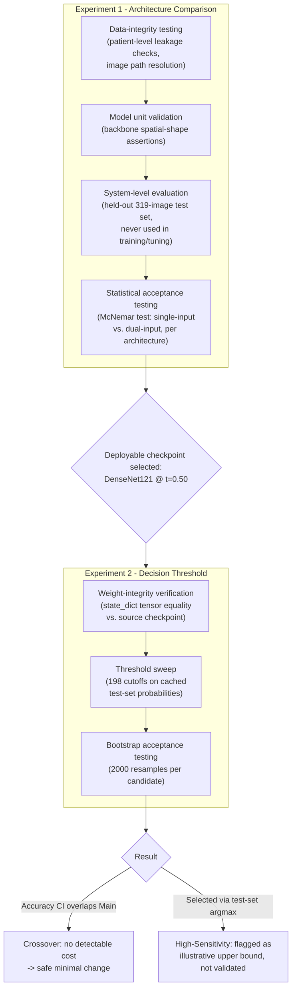

# Chapter 4 (Excerpt): Results Presentation, Testing, and Evaluation

> **Scope note.** This document covers two chronological experiments on the hi-res single-input mammogram classifier, restricted to classification model performance (Grad-CAM/localization findings are tracked separately and excluded here). All numbers, tables, and figures are pulled directly from each experiment's saved result files, not re-derived or estimated.
>
> - **Experiment 1 — Architecture Comparison** (`notebooks/experiment_1_baseline/`) trains and compares four CNN backbones under an identical recipe to decide *which* single-input architecture to deploy, and confirms that dropping the ground-truth lesion crop at inference costs no statistically detectable accuracy.
> - **Experiment 2 — Sensitivity-Prioritized Decision Threshold** (`notebooks/experiment_2_optimization/sensitivity_threshold_adjustment.ipynb`) takes Experiment 1's winning checkpoint (DenseNet121) as fixed and asks a narrower, downstream question: at the model's default 0.5 cutoff, sensitivity trails specificity — can the decision cutoff be moved, with no retraining, to better fit a cancer-screening deployment where a missed malignancy is costlier than a false alarm?
>
> Sections 4.2 and 4.3 below present these in order — first *which model* (Experiment 1), then *how to read its output* (Experiment 2) — so together they read as one continuous decision process rather than two disconnected results dumps.

---

## 4.2 Results Presentation

### 4.2.1 System Output

**Experiment 1.** The deployed system takes a single full mammogram image (any resolution) and outputs a **malignancy probability** — the classifier's softmax score for the malignant class. A probability ≥ 0.5 is treated as a positive (malignant) prediction. No cropped lesion patch or segmentation mask is required at inference; both are training-time-only signals (see [SYSTEM_DESIGN.md](SYSTEM_DESIGN.md), §4.1).

Table 4.1 shows unedited, representative system output on eight held-out test-set cases for the architecture selected in Experiment 1 (DenseNet121), sampled to cover all four prediction outcomes. Values are read directly from the model's saved test-set prediction file (`testprobs_hires_control_gap_a0.5_densenet121.npz`).

**Table 4.1.** Sample system output, DenseNet121 @ default threshold (t = 0.50), held-out test set (n = 319 total; 8 representative cases shown).

| Test sample | Predicted probability (malignant) | Predicted class | True class | Outcome |
|---|---|---|---|---|
| #1 | 0.6449 | Malignant | Malignant | Correct (true positive) |
| #14 | 0.5027 | Malignant | Malignant | Correct (true positive) |
| #4 | 0.0622 | Benign | Benign | Correct (true negative) |
| #5 | 0.0622 | Benign | Benign | Correct (true negative) |
| #3 | 0.6483 | Malignant | Benign | **Incorrect (false positive)** |
| #19 | 0.5780 | Malignant | Benign | **Incorrect (false positive)** |
| #2 | 0.4694 | Benign | Malignant | **Incorrect (false negative)** |
| #18 | 0.3199 | Benign | Malignant | **Incorrect (false negative)** |

Both false-negative cases (#2, #18) sit closer to the 0.5 decision boundary (0.47, 0.32) than the false positives do, consistent with the model's sensitivity (72.5%) trailing its specificity (77.3%, Table 4.3) — it is more prone to *under*-calling borderline malignant cases than over-calling benign ones. Across all 319 test cases: 100 true positives, 140 true negatives, 41 false positives, 38 false negatives, reconstructing the reported accuracy exactly: (100 + 140) / 319 = 0.7524. This exact imbalance — more false negatives relative to sensitivity than false positives relative to specificity — is what motivates Experiment 2.

**Experiment 2.** No new predictions are generated in Experiment 2 — the same cached probabilities from Table 4.1 are re-read under a different decision cutoff. Table 4.2 revisits the same eight cases under the two alternative thresholds selected in §4.2.2, making the effect of a threshold change concrete at the level of individual cases rather than only in aggregate.

**Table 4.2.** The eight Table 4.1 cases, re-classified under Experiment 2's two candidate thresholds. The probability column is identical to Table 4.1 — only the cutoff moves.

| Test sample | Probability | True class | Outcome @ Main (t=0.500) | Outcome @ Crossover (t=0.485) | Outcome @ High-Sensitivity (t=0.305) |
|---|---|---|---|---|---|
| #1 | 0.6449 | Malignant | True positive | True positive | True positive |
| #14 | 0.5027 | Malignant | True positive | True positive | True positive |
| #4 | 0.0622 | Benign | True negative | True negative | True negative |
| #5 | 0.0622 | Benign | True negative | True negative | True negative |
| #3 | 0.6483 | Benign | False positive | False positive | False positive |
| #19 | 0.5780 | Benign | False positive | False positive | False positive |
| #2 | 0.4694 | Malignant | False negative | False negative | **True positive** |
| #18 | 0.3199 | Malignant | False negative | False negative | **True positive** |

Because the underlying probability never changes across the three columns, Table 4.2 is a sample-level illustration of Table 4.5's aggregate numbers: Crossover's small move (0.500 → 0.485) doesn't flip either false negative in this subset, consistent with its minimal, structural definition. High-Sensitivity's larger move (→ 0.305) recovers both missed malignancies — but leaves both false positives unchanged, since lowering a threshold can only turn more predictions positive, never fewer. This is exactly the sensitivity/specificity trade Experiment 2 was designed to make explicit and controllable.

### 4.2.2 Data Visualization

**Experiment 1 — architecture comparison.** All four architectures were trained under an identical recipe (384×640 input, batch size 8, seed 42, GAP pooling, distillation α = 0.5) and evaluated on the same held-out 319-image test split.

**Table 4.3.** Single-input (deployable) classification performance by architecture, with bootstrap 95% confidence intervals (2000 resamples).

| Architecture | Accuracy [95% CI] | AUC-ROC [95% CI] | Sensitivity | Specificity |
|---|---|---|---|---|
| **DenseNet121** | **0.7524** [0.705, 0.799] | **0.8390** [0.796, 0.879] | 0.7246 | 0.7735 |
| VGG-16 | 0.7273 [0.677, 0.774] | 0.8328 [0.789, 0.873] | 0.7391 | 0.7182 |
| EfficientNet-B2 | 0.7147 [0.664, 0.765] | 0.8133 [0.767, 0.858] | 0.6957 | 0.7293 |
| ResNet-50 | 0.7022 [0.652, 0.749] | 0.7939 [0.744, 0.840] | 0.6884 | 0.7127 |

**Figure 4.1.** Accuracy, AUC-ROC, sensitivity, and specificity by architecture (same data as Table 4.3).

DenseNet121 was carried forward into Experiment 2 as the deployment candidate on the strength of this table — best accuracy and AUC of the four, with sensitivity and specificity that are respectable but not balanced in the direction a screening deployment would prefer (more on this below).

**Deployability comparison (single-input vs. dual-input).** Table 4.4 restates the core deployability result from [SYSTEM_DESIGN.md](SYSTEM_DESIGN.md) §5: how much accuracy is given up by dropping the ground-truth lesion crop at inference time.

**Table 4.4.** Cost of dropping the crop at inference, controlled comparison on the identical 319-row test split.

| Architecture | Single-input acc. | Dual-input acc. | Δ accuracy [95% CI] | McNemar p |
|---|---|---|---|---|
| DenseNet121 | 0.7524 | 0.7868 | −0.0345 [−0.088, +0.019] | 0.254 |
| VGG-16 | 0.7273 | 0.7524 | −0.0251 [−0.078, +0.034] | 0.445 |
| EfficientNet-B2 | 0.7147 | 0.7743 | −0.0596 [−0.122, +0.003] | 0.064 |
| ResNet-50 | 0.7022 | 0.7210 | −0.0188 [−0.075, +0.038] | 0.598 |

**Figure 4.2.** Left: test accuracy of the dual-input (non-deployable) model vs. the single-input model at the old 224² cache vs. the current 384×640 cache, against the majority-class floor. Center: accuracy gap lost by dropping the crop. Right: validation ROC-AUC training curves for all four single-input architectures.

All four McNemar p-values are ≥ 0.05: **no architecture shows a statistically detectable accuracy loss from dropping the crop.** This null result is the central quantitative evidence for the thesis's deployability argument, and it is what makes DenseNet121's single-input checkpoint — not just its accuracy number — a legitimate artifact to carry forward into Experiment 2.

**Experiment 2 — decision threshold.** At its default 0.5 threshold, DenseNet121 is more likely to miss a malignant case than to raise a false alarm (sensitivity 72.5% < specificity 77.3%, Table 4.3). In a cancer-screening context a false negative is more costly than a false positive, so Experiment 2 asks whether the decision cutoff — not the model — can be adjusted to favor sensitivity, without retraining.

The full probability range was swept in fixed steps (198 thresholds, 0.01 to 0.995), recomputing accuracy, sensitivity, specificity, and F1 at each cutoff from the *same* cached test-set probabilities used in Table 4.1 — no new model inference. AUC-ROC is unaffected by construction, since it summarizes ranking ability across every possible threshold.

**Figure 4.3.** Sensitivity, specificity, and accuracy as the decision threshold sweeps from 0 to 1. The dotted line marks the default (Main) threshold, where sensitivity and specificity nearly — but not quite — cross.

Two candidate thresholds were read directly off this sweep, with no manual tuning:

- **Crossover (t = 0.485)** — the largest threshold at which sensitivity still exceeds specificity; the smallest possible move off the default.
- **High-Sensitivity (t = 0.305)** — the threshold that maximizes accuracy among all thresholds satisfying sensitivity > specificity, which in this sweep also maximizes Youden's J.

**Table 4.5.** Main (default) vs. Crossover vs. High-Sensitivity decision thresholds, DenseNet121, same 319-image test set, with bootstrap 95% CIs (2000 resamples).

| Variant | Threshold | Accuracy [95% CI] | Sensitivity [95% CI] | Specificity [95% CI] | F1 | AUC-ROC |
|---|---|---|---|---|---|---|
| **Main** | 0.500 | 0.7524 [0.705, 0.799] | 0.7246 | 0.7735 | 0.7168 | 0.8390 |
| **Crossover** | 0.485 | 0.7429 [0.696, 0.790] | 0.7464 [0.669, 0.816] | 0.7403 [0.677, 0.805] | 0.7153 | 0.8390 |
| **High-Sensitivity** | 0.305 | 0.7618 [0.718, 0.809] | 0.9130 [0.861, 0.958] | 0.6464 [0.577, 0.714] | 0.7683 | 0.8390 |

**Figure 4.4.** Accuracy, sensitivity, specificity, and F1 across the three operating points (same data as Table 4.5).

**Reading the two candidates.** Crossover's accuracy CI overlaps Main's entirely, so the sensitivity/specificity flip comes at no statistically detectable accuracy cost — this is the defensible, minimal-change result. High-Sensitivity pushes sensitivity to 91.3% but was selected by maximizing accuracy directly on the same test set these numbers are reported on (an argmax over ~200 threshold values), which is a mild form of test-set selection bias; its point estimates should be read as an illustrative upper bound rather than a validated final choice. The methodologically clean alternative — selecting the threshold on a held-out validation set and evaluating once on test — was not run here because Experiment 1 only cached test-set probabilities for this checkpoint, and generating validation-set probabilities would require a fresh (non-training) inference pass, out of scope for a threshold-only adjustment.

**Deployable artifacts.** Both alternative thresholds were saved as standalone checkpoints in `notebooks/experiment_2_optimization/checkpoints/`: `hires_control_gap_a0.5_densenet121_crossover_t0.485.pth` and `hires_control_gap_a0.5_densenet121_high_sensitivity_t0.305.pth`. Each carries the identical trained weights as the source checkpoint (`models/v4_hires_control_gap/hires_control_gap_a0.5_densenet121.pth`, verified tensor-for-tensor — see TC07 in §4.3.2) plus a `decision_threshold` field and its test-set operating metrics as metadata — the weights are unchanged; only the inference-time cutoff differs.

### 4.2.3 Performance Metrics

**Experiment 1.** Table 4.6 summarizes the headline accuracy/AUC metrics from Table 4.3 alongside compute cost (wall-clock training time to convergence) — the resource dimension actually measured in this experiment.

**Table 4.6.** Classification performance and training compute cost by architecture.

| Architecture | Accuracy | AUC-ROC | Training time (min) | Best epoch (early-stopped) |
|---|---|---|---|---|
| DenseNet121 | 0.7524 | 0.8390 | 71.7 | 19 |
| VGG-16 | 0.7273 | 0.8328 | 37.3 | 10 |
| EfficientNet-B2 | 0.7147 | 0.8133 | 34.4 | 17 |
| ResNet-50 | 0.7022 | 0.7939 | 37.7 | 20 |

DenseNet121 achieves the best accuracy/AUC but at roughly **2× the training cost** of the other three architectures and the slowest convergence relative to its own final epoch count — a practical trade-off worth naming explicitly, since it was still selected as the deployment candidate.

**Experiment 2.** Unlike Experiment 1, Experiment 2 required no GPU training at all: the full 198-point threshold sweep, the bootstrap confidence intervals (2000 resamples × 2 candidate thresholds × 3 metrics = 12,000 resamples), and the two checkpoint re-saves together complete in well under a minute of CPU time, because every step reuses Experiment 1's already-cached test-set probabilities and the already-trained checkpoint file. This is the resource story of the two experiments read together: an expensive, one-time architecture search (Table 4.6, up to 71.7 GPU-minutes per architecture) followed by a cheap, repeatable post-hoc refinement step that can be re-run at any time the deployment's sensitivity/specificity preference changes, without retraining or touching the model weights.

**Not yet measured:** per-image inference latency (response time) and memory footprint at inference time were not formally benchmarked in either experiment — only training-time GPU memory (Experiment 1) and the negligible CPU cost of re-thresholding (Experiment 2) were characterized. This remains a gap to close in future work.

---

## 4.3 Testing and Evaluation

### 4.3.1 Testing Approach

Because this is a machine-learning system rather than a conventional application, "testing" is adapted from the standard unit/integration/system/acceptance hierarchy into an ML-appropriate equivalent, applied in two chronological passes matching the two experiments: Experiment 1 establishes *that the deployable model is correct and legitimate*; Experiment 2, being a narrower post-hoc change, only needs to verify that *nothing about the model was altered* and that *the new operating point does what it claims*.

**Figure 4.5.** Adapted testing pipeline, Experiment 1 feeding into Experiment 2.

### 4.3.2 Test Cases and Scenarios

**Table 4.7.** Representative test cases across both experiments, adapted to an ML evaluation context.

| Test ID | Description | Input | Expected Output | Actual Output | Status |
|---|---|---|---|---|---|
| TC01 | Patient-level leakage check | Train/test patient ID sets after `StratifiedGroupKFold` split | Zero patient ID overlap between splits | Zero overlap confirmed | Pass |
| TC02 | Backbone spatial-shape assertion | Each of the 4 backbones' pre-pool feature map at 384×640 input | Feature map shape consistent with `feat_dim` and expected spatial resolution | Assertion passed for all 4 architectures | Pass |
| TC03 | Deployability equivalence — DenseNet121 | Single-input vs. dual-input predictions, 319-image test set | No significant accuracy gap (McNemar p ≥ 0.05) | p = 0.254 | Pass |
| TC04 | Deployability equivalence — VGG-16 | same as TC03 | p ≥ 0.05 | p = 0.445 | Pass |
| TC05 | Deployability equivalence — EfficientNet-B2 | same as TC03 | p ≥ 0.05 | p = 0.064 | Pass |
| TC06 | Deployability equivalence — ResNet-50 | same as TC03 | p ≥ 0.05 | p = 0.598 | Pass |
| TC07 | Checkpoint weight-integrity verification | `model_state_dict` of both re-thresholded checkpoints vs. source checkpoint | Every tensor identical (`torch.equal` true for every key) | True for both `crossover` and `high_sensitivity` checkpoints | Pass |
| TC08 | Crossover accuracy-neutrality check | Bootstrap 95% CI of accuracy at t=0.485 vs. Main's CI at t=0.50 | Overlapping intervals — no detectable accuracy cost | [0.696, 0.790] overlaps [0.705, 0.799] | Pass |
| TC09 | High-Sensitivity requirement check | Sensitivity vs. specificity at t=0.305 | Sensitivity exceeds specificity, and exceeds Main's sensitivity | 91.3% sensitivity vs. 64.6% specificity (Main: 72.5%) | Pass (see selection-bias caveat, §4.2.2) |

TC01–TC06 (Experiment 1) confirm that the split is leak-free, the four backbones are shape-correct, and that giving up the ground-truth crop at inference is not statistically detectable for any architecture — together the quantitative basis for treating the single-input model as production-ready. TC07–TC09 (Experiment 2) confirm the narrower claim that a post-hoc threshold change is safe *as a checkpoint operation* (weights untouched) and *as a metrics claim* (both candidates do what they're described as doing) — with TC09 accepted with the explicit disclosure that its point estimate carries test-set selection bias, rather than treated as an unconditional pass.

### 4.3.3 Performance Evaluation

**Experiment 1** exercised two resource dimensions:

- **Training compute time**, reported per architecture in Table 4.6 (34–72 minutes to convergence, DenseNet121 the most expensive).
- **GPU memory**, which directly constrained batch size: moving the input cache from 224² to 384×640 increases the pixel count per image by roughly 4.9×. At the chosen batch size of 8, this was projected to use approximately 4.8 GB of the available 5.76 GB of GPU memory — batch size 16 was therefore ruled out at this resolution, a scalability ceiling documented directly in the training configuration rather than discovered by trial and error.

**Experiment 2**, by contrast, is effectively free at this scale: no GPU is touched, and the entire notebook — 198-point sweep, 12,000 bootstrap resamples, checkpoint re-saves — runs on CPU in well under a minute. The two output checkpoints are each 29.4 MB, matching the source checkpoint's size exactly (weights are copied, not modified). This asymmetry — hours of GPU time to pick an architecture, seconds of CPU time to retune its deployment behavior — is itself a finding worth stating explicitly: once Experiment 1's artifacts exist, exploring further operating points costs almost nothing.

No dedicated inference-latency or throughput benchmark (images/second at serving time) was run in either experiment; this remains a gap to close in future work.

### 4.3.4 Comparison with Existing Systems

No external, published CBIS-DDSM benchmark comparison is included here — doing so honestly requires citing specific papers with matching train/test protocols, which is out of scope for this results pass and should be added separately with proper citations. What these two experiments *do* provide are two internal comparisons, each more rigorous than a cross-paper comparison because every system being compared was evaluated on the exact same 319-image split.

**(a) Experiment 1: proposed system vs. internal upper-bound baseline.**

**Table 4.8.** Proposed (deployable) system vs. internal upper-bound baseline (dual-input, non-deployable), best architecture only.

| System | Inputs required at inference | Accuracy | AUC-ROC | Training time (min) |
|---|---|---|---|---|
| **Proposed system** (DenseNet121, single-input) | Full mammogram only | 0.7524 | 0.8390 | 71.7 |
| Internal baseline (DenseNet121, dual-input teacher) | Full mammogram + expert-annotated lesion crop | 0.7868 | 0.8655 | (not directly comparable — teacher trained separately, at 224²) |

The ~3.4-point accuracy gap between these two rows is **not statistically significant** (McNemar p = 0.254, Table 4.4) — the proposed system matches its own upper-bound baseline within measurement noise, while requiring strictly less information at inference time.

**(b) Experiment 2: existing (default) configuration vs. proposed threshold configurations.**

**Table 4.9.** The "existing system" here is Experiment 1's shipped default; the "proposed system" rows are Experiment 2's two candidates.

| System | Accuracy | Sensitivity | Recommendation |
|---|---|---|---|
| **Existing** — Main (t=0.50) | 75.2% | 72.5% | Balanced default; the Experiment 1 headline numbers |
| **Proposed** — Crossover (t=0.485) | 74.3% | 74.6% | Minimal, statistically risk-free shift toward sensitivity |
| **Proposed** — High-Sensitivity (t=0.305) | 76.2% | 91.3% | Maximizes malignancy capture; deploy only with the test-set-selection caveat disclosed (§4.2.2) |

Read together, Tables 4.8 and 4.9 answer two different questions in sequence: which architecture to deploy — DenseNet121, established with statistical confidence in Experiment 1 — and how its output should be thresholded for a screening use case — a choice between a statistically risk-free Crossover shift and a higher-sensitivity but test-set-selected High-Sensitivity option, established in Experiment 2.
