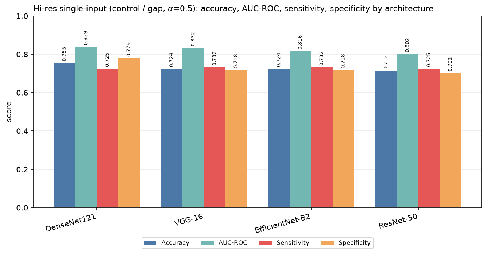
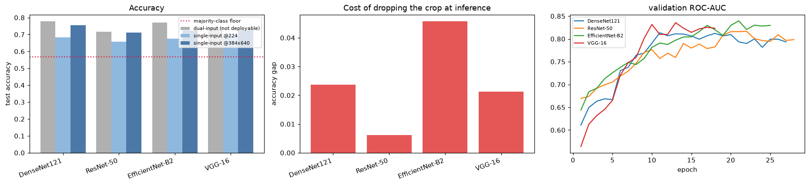
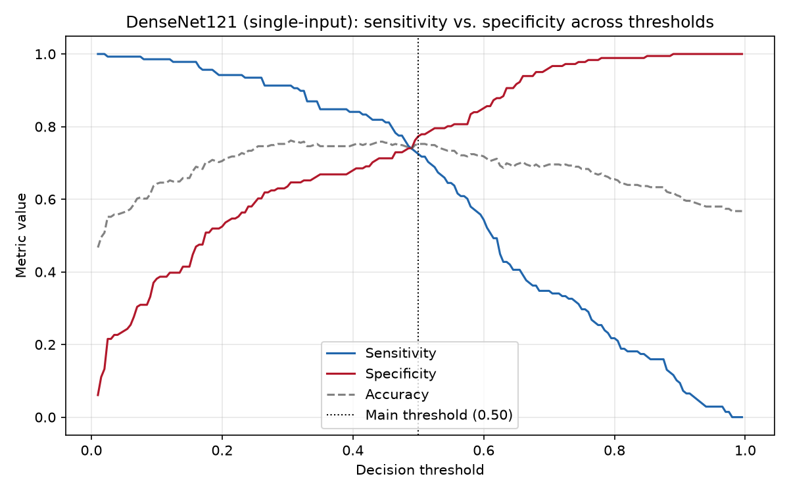
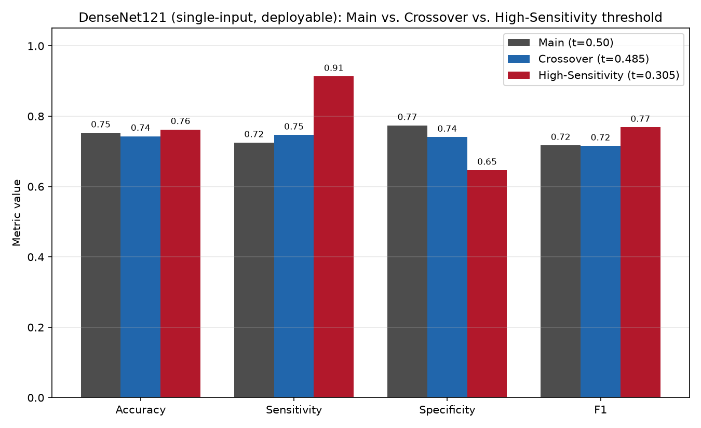
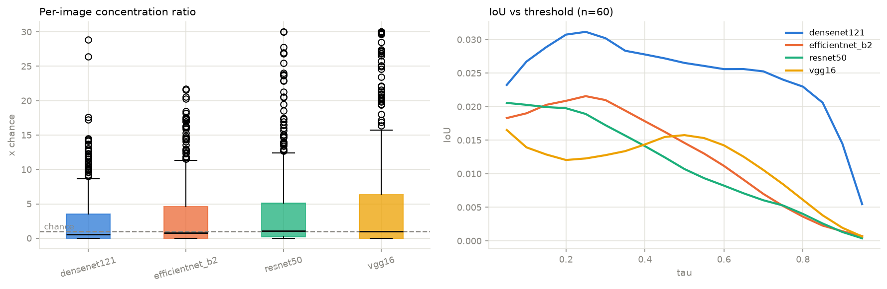
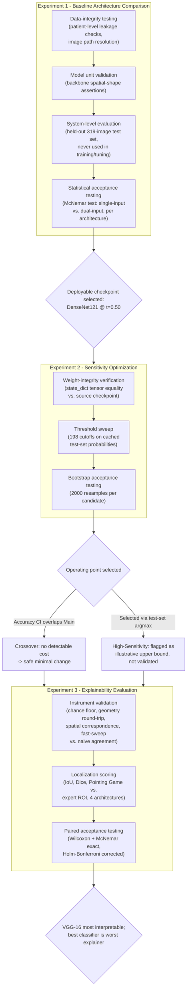

# Chapter 4 (Excerpt): Results Presentation, Testing, and Evaluation

> **Scope note.** This document covers three chronological experiments on the hi-res single-input mammogram classifier. All numbers, tables, and figures are pulled directly from each experiment's saved result files, not re-derived or estimated.
>
> - **Experiment 1 — Baseline Architecture Comparison** (`notebooks/experiment_1_baseline/`) trains and compares four CNN backbones under an identical recipe to decide *which* single-input architecture to deploy, and confirms that dropping the ground-truth lesion crop at inference costs no statistically detectable accuracy.
> - **Experiment 2 — Sensitivity Optimization** (`notebooks/experiment_2_optimization/sensitivity_threshold_adjustment.ipynb`) takes Experiment 1's winning checkpoint (DenseNet121) as fixed and asks a narrower, downstream question: at the model's default 0.5 cutoff, sensitivity trails specificity — can the decision cutoff be moved, with no retraining, to better fit a cancer-screening deployment where a missed malignancy is costlier than a false alarm?
> - **Experiment 3 — Explainability Evaluation** (`notebooks/explainability/gradcam_validation.ipynb`) asks whether the model's Grad-CAM explanations actually point at the lesion, scored against CBIS-DDSM's expert ROI masks on the same 319-image test split, for all four architectures.
>
> Sections 4.2 and 4.3 below present these in order — first *which model* (Experiment 1), then *how to read its output* (Experiment 2), then *whether its explanation can be trusted* (Experiment 3) — so together they read as one continuous decision process rather than three disconnected results dumps.

---

## 4.2 Results Presentation

### 4.2.1 System Output

**Experiment 1.** The deployed system takes a single full mammogram image (any resolution) and outputs a **malignancy probability** — the classifier's softmax score for the malignant class. A probability ≥ 0.5 is treated as a positive (malignant) prediction. No cropped lesion patch or segmentation mask is required at inference; both are training-time-only signals (see [SYSTEM_DESIGN.md](SYSTEM_DESIGN.md), §4.1).

Table 4.1 shows unedited, representative system output on eight held-out test-set cases for the architecture selected in Experiment 1 (DenseNet121), sampled to cover all four prediction outcomes. Values are read directly from the model's saved test-set prediction file (`testprobs_hires_control_gap_a0.5_densenet121.npz`).

**Table 4.1.** Sample system output, DenseNet121 @ default threshold (t = 0.50), held-out test set (n = 319 total; 8 representative cases shown).

| Test sample | Predicted probability (malignant) | Predicted class | True class | Outcome |
|---|---|---|---|---|
| #1 | 0.6449 | Malignant | Malignant | Correct (true positive) |
| #14 | 0.5027 | Malignant | Malignant | Correct (true positive) |
| #4 | 0.0622 | Benign | Benign | Correct (true negative) |
| #5 | 0.0622 | Benign | Benign | Correct (true negative) |
| #3 | 0.6483 | Malignant | Benign | **Incorrect (false positive)** |
| #19 | 0.5780 | Malignant | Benign | **Incorrect (false positive)** |
| #2 | 0.4694 | Benign | Malignant | **Incorrect (false negative)** |
| #18 | 0.3199 | Benign | Malignant | **Incorrect (false negative)** |

Both false-negative cases (#2, #18) sit closer to the 0.5 decision boundary (0.47, 0.32) than the false positives do, consistent with the model's sensitivity (72.5%) trailing its specificity (77.3%, Table 4.5) — it is more prone to *under*-calling borderline malignant cases than over-calling benign ones. Across all 319 test cases: 100 true positives, 140 true negatives, 41 false positives, 38 false negatives, reconstructing the reported accuracy exactly: (100 + 140) / 319 = 0.7524. This exact imbalance — more false negatives relative to sensitivity than false positives relative to specificity — is what motivates Experiment 2.

**Experiment 2.** No new predictions are generated in Experiment 2 — the same cached probabilities from Table 4.1 are re-read under a different decision cutoff. Table 4.2 revisits the same eight cases under the two alternative thresholds selected in §4.2.2, making the effect of a threshold change concrete at the level of individual cases rather than only in aggregate.

**Table 4.2.** The eight Table 4.1 cases, re-classified under Experiment 2's two candidate thresholds. The probability column is identical to Table 4.1 — only the cutoff moves.

| Test sample | Probability | True class | Outcome @ Main (t=0.500) | Outcome @ Crossover (t=0.485) | Outcome @ High-Sensitivity (t=0.305) |
|---|---|---|---|---|---|
| #1 | 0.6449 | Malignant | True positive | True positive | True positive |
| #14 | 0.5027 | Malignant | True positive | True positive | True positive |
| #4 | 0.0622 | Benign | True negative | True negative | True negative |
| #5 | 0.0622 | Benign | True negative | True negative | True negative |
| #3 | 0.6483 | Benign | False positive | False positive | False positive |
| #19 | 0.5780 | Benign | False positive | False positive | False positive |
| #2 | 0.4694 | Malignant | False negative | False negative | **True positive** |
| #18 | 0.3199 | Malignant | False negative | False negative | **True positive** |

Because the underlying probability never changes across the three columns, Table 4.2 is a sample-level illustration of Table 4.7's aggregate numbers: Crossover's small move (0.500 → 0.485) doesn't flip either false negative in this subset, consistent with its minimal, structural definition. High-Sensitivity's larger move (→ 0.305) recovers both missed malignancies — but leaves both false positives unchanged, since lowering a threshold can only turn more predictions positive, never fewer. This is exactly the sensitivity/specificity trade Experiment 2 was designed to make explicit and controllable.

**Experiment 3.** The system's second output is the **explanation**: a Grad-CAM heatmap at the caller's original image resolution, indicating which regions drove the malignancy score. Because the Experiment 2 checkpoints carry weights byte-identical to Experiment 1's (verified in TC07), the heatmap for a given image is the same under all three thresholds — the threshold changes only which cases count as correctly classified, not what the model looked at.

Table 4.3 carries the *same eight cases* through to their explanation scores, so the reader can follow one set of images across all three experiments. `Peak distance` is the pixel distance from the heatmap's hottest point to the nearest edge of the expert ROI.

**Table 4.3.** Grad-CAM localization output for the eight Table 4.1 cases, DenseNet121, τ = 0.50. Classification outcome is repeated from Table 4.1 for reference.

| Test sample | Classification outcome | IoU | Dice | Pointing hit | Peak distance (px) |
|---|---|---|---|---|---|
| #1 | True positive | 0.0002 | 0.0003 | No | 410 |
| #14 | True positive | 0.0000 | 0.0000 | No | 326 |
| #4 | True negative | 0.0000 | 0.0000 | No | 184 |
| #5 | True negative | 0.0000 | 0.0000 | No | 219 |
| #3 | False positive | 0.0000 | 0.0000 | No | 286 |
| #19 | False positive | 0.0000 | 0.0000 | No | 210 |
| #2 | False negative | 0.0000 | 0.0000 | No | 331 |
| #18 | False negative | 0.0000 | 0.0000 | No | 315 |

**This table is negative across the board, and that is the finding, not a reporting failure.** All eight cases — including the two correct malignant calls — miss the lesion entirely, with peak distances of 184–410 px on a 384 × 640 canvas. Sample #1 is the clearest statement of the problem: the model assigns 0.6449 to a genuinely malignant case and gets the *answer* right while pointing at tissue hundreds of pixels away from the annotated lesion. **Classification correctness and localization correctness are close to independent in this system**, which is precisely why Experiment 3 exists as a separate evaluation rather than being folded into the accuracy numbers.

The eight cases were selected in Table 4.1 to span the classification confusion matrix, not to be representative of localization, and at DenseNet121's overall 9.7% pointing-game accuracy (Table 4.8) a run of eight misses is unremarkable. Table 4.4 therefore shows the opposite tail — the cases the same model localizes best — so that the range of system behavior is visible rather than only its failures.

**Table 4.4.** The four best-localized test cases for DenseNet121 (ranked by Dice at τ = 0.50), same checkpoint and same test split.

| Test sample | Probability | True class | IoU | Dice | Pointing hit | Concentration ratio |
|---|---|---|---|---|---|---|
| #94 | 0.5562 | Malignant | 0.5010 | 0.6676 | Yes | 10.8× |
| #213 | 0.8952 | Malignant | 0.4342 | 0.6055 | Yes | 12.7× |
| #192 | 0.8925 | Malignant | 0.4055 | 0.5770 | Yes | 8.5× |
| #183 | 0.9157 | Malignant | 0.3549 | 0.5239 | Yes | 10.1× |

When the model does localize, it localizes well — Dice above 0.5 with the heatmap peak landing inside the ROI and eight to thirteen times more attention on the lesion than chance. All four are malignant cases, three of them high-confidence (p > 0.89). The behavior is therefore **bimodal rather than uniformly poor**: strong, confident malignant findings tend to be explained correctly, while everything else is explained close to arbitrarily. §4.2.2 quantifies both halves of that split.

### 4.2.2 Data Visualization

**Experiment 1 — architecture comparison.** All four architectures were trained under an identical recipe (384×640 input, batch size 8, seed 42, GAP pooling, distillation α = 0.5) and evaluated on the same held-out 319-image test split.

**Table 4.5.** Single-input (deployable) classification performance by architecture, with bootstrap 95% confidence intervals (2000 resamples).

| Architecture | Accuracy [95% CI] | AUC-ROC [95% CI] | Sensitivity | Specificity |
|---|---|---|---|---|
| **DenseNet121** | **0.7524** [0.705, 0.799] | **0.8390** [0.796, 0.879] | 0.7246 | 0.7735 |
| VGG-16 | 0.7273 [0.677, 0.774] | 0.8328 [0.789, 0.873] | 0.7391 | 0.7182 |
| EfficientNet-B2 | 0.7147 [0.664, 0.765] | 0.8133 [0.767, 0.858] | 0.6957 | 0.7293 |
| ResNet-50 | 0.7022 [0.652, 0.749] | 0.7939 [0.744, 0.840] | 0.6884 | 0.7127 |

**Figure 4.1.** Accuracy, AUC-ROC, sensitivity, and specificity by architecture (same data as Table 4.5).

DenseNet121 was carried forward into Experiment 2 as the deployment candidate on the strength of this table — best accuracy and AUC of the four, with sensitivity and specificity that are respectable but not balanced in the direction a screening deployment would prefer (more on this below).

**Deployability comparison (single-input vs. dual-input).** Table 4.6 restates the core deployability result from [SYSTEM_DESIGN.md](SYSTEM_DESIGN.md) §5: how much accuracy is given up by dropping the ground-truth lesion crop at inference time.

**Table 4.6.** Cost of dropping the crop at inference, controlled comparison on the identical 319-row test split.

| Architecture | Single-input acc. | Dual-input acc. | Δ accuracy [95% CI] | McNemar p |
|---|---|---|---|---|
| DenseNet121 | 0.7524 | 0.7868 | −0.0345 [−0.088, +0.019] | 0.254 |
| VGG-16 | 0.7273 | 0.7524 | −0.0251 [−0.078, +0.034] | 0.445 |
| EfficientNet-B2 | 0.7147 | 0.7743 | −0.0596 [−0.122, +0.003] | 0.064 |
| ResNet-50 | 0.7022 | 0.7210 | −0.0188 [−0.075, +0.038] | 0.598 |

**Figure 4.2.** Left: test accuracy of the dual-input (non-deployable) model vs. the single-input model at the old 224² cache vs. the current 384×640 cache, against the majority-class floor. Center: accuracy gap lost by dropping the crop. Right: validation ROC-AUC training curves for all four single-input architectures.

All four McNemar p-values are ≥ 0.05: **no architecture shows a statistically detectable accuracy loss from dropping the crop.** This null result is the central quantitative evidence for the thesis's deployability argument, and it is what makes DenseNet121's single-input checkpoint — not just its accuracy number — a legitimate artifact to carry forward into Experiment 2.

**Experiment 2 — decision threshold.** At its default 0.5 threshold, DenseNet121 is more likely to miss a malignant case than to raise a false alarm (sensitivity 72.5% < specificity 77.3%, Table 4.5). In a cancer-screening context a false negative is more costly than a false positive, so Experiment 2 asks whether the decision cutoff — not the model — can be adjusted to favor sensitivity, without retraining.

The full probability range was swept in fixed steps (198 thresholds, 0.01 to 0.995), recomputing accuracy, sensitivity, specificity, and F1 at each cutoff from the *same* cached test-set probabilities used in Table 4.1 — no new model inference. AUC-ROC is unaffected by construction, since it summarizes ranking ability across every possible threshold.

**Figure 4.3.** Sensitivity, specificity, and accuracy as the decision threshold sweeps from 0 to 1. The dotted line marks the default (Main) threshold, where sensitivity and specificity nearly — but not quite — cross.

Two candidate thresholds were read directly off this sweep, with no manual tuning:

- **Crossover (t = 0.485)** — the largest threshold at which sensitivity still exceeds specificity; the smallest possible move off the default.
- **High-Sensitivity (t = 0.305)** — the threshold that maximizes accuracy among all thresholds satisfying sensitivity > specificity, which in this sweep also maximizes Youden's J.

**Table 4.7.** Main (default) vs. Crossover vs. High-Sensitivity decision thresholds, DenseNet121, same 319-image test set, with bootstrap 95% CIs (2000 resamples).

| Variant | Threshold | Accuracy [95% CI] | Sensitivity [95% CI] | Specificity [95% CI] | F1 | AUC-ROC |
|---|---|---|---|---|---|---|
| **Main** | 0.500 | 0.7524 [0.705, 0.799] | 0.7246 | 0.7735 | 0.7168 | 0.8390 |
| **Crossover** | 0.485 | 0.7429 [0.696, 0.790] | 0.7464 [0.669, 0.816] | 0.7403 [0.677, 0.805] | 0.7153 | 0.8390 |
| **High-Sensitivity** | 0.305 | 0.7618 [0.718, 0.809] | 0.9130 [0.861, 0.958] | 0.6464 [0.577, 0.714] | 0.7683 | 0.8390 |

**Figure 4.4.** Accuracy, sensitivity, specificity, and F1 across the three operating points (same data as Table 4.7).

**Reading the two candidates.** Crossover's accuracy CI overlaps Main's entirely, so the sensitivity/specificity flip comes at no statistically detectable accuracy cost — this is the defensible, minimal-change result. High-Sensitivity pushes sensitivity to 91.3% but was selected by maximizing accuracy directly on the same test set these numbers are reported on (an argmax over ~200 threshold values), which is a mild form of test-set selection bias; its point estimates should be read as an illustrative upper bound rather than a validated final choice. The methodologically clean alternative — selecting the threshold on a held-out validation set and evaluating once on test — was not run here because Experiment 1 only cached test-set probabilities for this checkpoint, and generating validation-set probabilities would require a fresh (non-training) inference pass, out of scope for a threshold-only adjustment.

**Deployable artifacts.** Both alternative thresholds were saved as standalone checkpoints in `notebooks/experiment_2_optimization/checkpoints/`: `hires_control_gap_a0.5_densenet121_crossover_t0.485.pth` and `hires_control_gap_a0.5_densenet121_high_sensitivity_t0.305.pth`. Each carries the identical trained weights as the source checkpoint (`models/v4_hires_control_gap/hires_control_gap_a0.5_densenet121.pth`, verified tensor-for-tensor — see TC07 in §4.3.2) plus a `decision_threshold` field and its test-set operating metrics as metadata — the weights are unchanged; only the inference-time cutoff differs.

**Experiment 3 — explanation quality.** Grad-CAM heatmaps were scored against CBIS-DDSM's expert ROI masks on the same 319 test images, for all four architectures, at a threshold τ = 0.50 fixed *a priori* by Grad-CAM/WSOL convention (before any score was inspected). All pixel sets are restricted to the non-padding region of the canvas, since a heatmap peak landing on black letterbox padding is meaningless.

**Table 4.8.** The three headline localization metrics per architecture, with bootstrap 95% CIs (2000 resamples), n = 319, τ = 0.50. Sorted by Dice.

| Architecture | IoU [95% CI] | Dice [95% CI] | Pointing Game acc. [95% CI] | Concentration ratio | Pixel AUROC | Peak in padding |
|---|---|---|---|---|---|---|
| **VGG-16** | **0.0761** [0.059, 0.095] | **0.1102** [0.088, 0.135] | **16.93%** [12.9, 21.0] | **5.92×** | 0.661 | 2.51% |
| ResNet-50 | 0.0487 [0.036, 0.062] | 0.0752 [0.058, 0.094] | 9.09% [6.0, 12.5] | 4.26× | 0.655 | 1.25% |
| EfficientNet-B2 | 0.0464 [0.036, 0.057] | 0.0758 [0.060, 0.091] | 8.78% [6.0, 12.2] | 3.38× | 0.621 | 1.57% |
| DenseNet121 | 0.0351 [0.026, 0.044] | 0.0584 [0.045, 0.072] | 9.72% [6.6, 13.2] | 2.74× | 0.611 | 1.88% |

**Figure 4.5.** IoU, Dice, and Pointing Game accuracy by architecture with bootstrap confidence intervals.

**How to read these numbers.** The chance floor for the pointing game is the lesion's share of valid pixels — a mean of **1.14%** across the test set. Every architecture therefore beats chance by a wide margin (VGG-16 by 14.8×, DenseNet121 by 8.5×), and the concentration ratio says the same thing threshold-free: VGG-16 places 5.92 times more heatmap mass on the lesion than an image-blind heatmap would. The explanations are **not** random. The `peak in padding` column is a fraud check — a model keying on canvas geometry rather than tissue would show an elevated rate there, and none does.

The **absolute IoU and Dice values are low, and are partly a resolution artifact rather than a localization error.** The lesion covers ~1–2.5% of valid pixels, while at 384 × 640 every one of these backbones downsamples by 32 to a 20 × 12 feature grid — so the smallest blob Grad-CAM can draw is roughly one 32 × 32-px cell. A perfectly placed single-cell blob still caps out at a modest IoU. This is why the threshold-free pointing game is the number to lead with in text, and why IoU and Dice should never be quoted without stating τ. Note also that Dice = 2·IoU/(1+IoU): they are one measurement reported two conventional ways, not two agreeing metrics.

**Table 4.9.** Pairwise architecture comparisons, Holm–Bonferroni corrected across the six pairs. Wilcoxon signed-rank for IoU/Dice (continuous, long-tailed); McNemar's exact test for the paired binary pointing game. All four architectures scored the identical images in the identical order, so all tests are paired.

| Metric | Comparison | Δ | p (Holm-adjusted) | Significant |
|---|---|---|---|---|
| Dice | VGG-16 > DenseNet121 | +0.0518 | 7.3e−07 | **Yes** |
| Dice | VGG-16 > ResNet-50 | +0.0350 | 1.1e−04 | **Yes** |
| Dice | VGG-16 > EfficientNet-B2 | +0.0344 | 2.1e−04 | **Yes** |
| Dice | EfficientNet-B2 > DenseNet121 | +0.0174 | 2.4e−03 | **Yes** |
| Dice | ResNet-50 > DenseNet121 | +0.0168 | 0.108 | No |
| Dice | EfficientNet-B2 ≈ ResNet-50 | +0.0006 | 0.860 | No |
| Pointing | VGG-16 > EfficientNet-B2 | +8.15 pp | 3.3e−04 | **Yes** |
| Pointing | VGG-16 > ResNet-50 | +7.84 pp | 2.5e−04 | **Yes** |
| Pointing | VGG-16 > DenseNet121 | +7.21 pp | 3.3e−04 | **Yes** |
| Pointing | remaining three, mutually | ≤ 0.94 pp | 1.00 | No |

**Figure 4.6.** Interpretability ranking across all metrics, with the accuracy ranking alongside.

**VGG-16 is significantly the most interpretable architecture on every metric, and the other three are statistically indistinguishable from one another** (with the single exception of EfficientNet-B2 over DenseNet121 on Dice). This produces the central tension of Experiment 3: **the best classifier is the worst explainer.** DenseNet121 ranks 1st on accuracy and AUC (Table 4.5) but 4th on mean interpretability rank (3.5 of 4), while VGG-16 ranks 2nd on accuracy and 1st on interpretability (mean rank 1.25). §4.3.4 tabulates this inversion directly.

**Table 4.10.** Localization broken down by true class, τ = 0.50.

| Architecture | Benign (n=181) IoU / Dice / PGA | Malignant (n=138) IoU / Dice / PGA |
|---|---|---|
| VGG-16 | 0.023 / 0.036 / 3.31% | **0.146 / 0.208 / 34.78%** |
| ResNet-50 | 0.014 / 0.022 / 1.10% | 0.094 / 0.146 / 19.57% |
| EfficientNet-B2 | 0.017 / 0.029 / 2.21% | 0.085 / 0.137 / 17.39% |
| DenseNet121 | 0.013 / 0.023 / 2.76% | 0.064 / 0.105 / 18.84% |

**Figure 4.7.** Localization metrics split by benign vs. malignant, per architecture.

**The class split is the largest effect in Experiment 3 — larger than the architecture effect.** Every architecture localizes malignant lesions roughly 5–10× better than benign ones (VGG-16: 34.8% vs. 3.3% pointing accuracy). This is expected rather than anomalous: the heatmap is always computed with respect to the *malignant* class (`class_idx = 1`, pinned so that benign and malignant cases are explained with respect to the same clinical question), so on a benign case the model is being asked "what here looks malignant" about an image where the honest answer is "nothing" — and a diffuse, low-information heatmap is the correct response, not a failure. The malignant-case numbers are therefore the clinically meaningful ones, and on those VGG-16 puts the peak inside the expert ROI on **better than one in three** cases.

**Table 4.11.** Localization by classification correctness, DenseNet121 (deployed) and VGG-16 (most interpretable), at both the Main and High-Sensitivity thresholds from Experiment 2.

| Model | Threshold | Correctly classified — n / Dice / PGA | Misclassified — n / Dice / PGA |
|---|---|---|---|
| DenseNet121 | 0.500 | 240 / 0.0645 / 11.67% | 79 / 0.0398 / 3.80% |
| DenseNet121 | 0.305 | 243 / 0.0674 / 11.93% | 76 / 0.0297 / 2.63% |
| VGG-16 | 0.500 | 232 / 0.1194 / 18.10% | 87 / 0.0856 / 13.79% |
| VGG-16 | 0.305 | 228 / 0.1319 / 20.18% | 91 / 0.0557 / 8.79% |

Correctly classified cases are localized roughly two to three times better than misclassified ones on both models — the explanation quality and the prediction quality are positively related in aggregate, even though Table 4.3 shows the relationship is far from deterministic case by case. Adopting Experiment 2's High-Sensitivity threshold **widens** this separation (DenseNet121 misclassified PGA falls from 3.80% to 2.63%; VGG-16 from 13.79% to 8.79%) without materially changing the correctly-classified figures, meaning the extra positives the lower threshold recovers are drawn disproportionately from well-localized cases. This is a modest point in the threshold change's favor that the accuracy numbers in Table 4.7 do not capture.

**Figure 4.8.** Grad-CAM overlays at original resolution — original image, expert ROI contour (green), and heatmap — for VGG-16. This is what a radiologist would actually be shown.

**Figure 4.9.** Appendix — mean IoU and Dice for all four architectures across every threshold τ from 0.05 to 0.95. The vertical order of the curves is preserved across the whole range, so the ranking in Table 4.8 is a property of the models and not of the a priori τ = 0.50 choice.

### 4.2.3 Performance Metrics

**Experiment 1.** Table 4.12 summarizes the headline accuracy/AUC metrics from Table 4.5 alongside compute cost (wall-clock training time to convergence) — the resource dimension actually measured in this experiment.

**Table 4.12.** Classification performance and training compute cost by architecture.

| Architecture | Accuracy | AUC-ROC | Training time (min) | Best epoch (early-stopped) |
|---|---|---|---|---|
| DenseNet121 | 0.7524 | 0.8390 | 71.7 | 19 |
| VGG-16 | 0.7273 | 0.8328 | 37.3 | 10 |
| EfficientNet-B2 | 0.7147 | 0.8133 | 34.4 | 17 |
| ResNet-50 | 0.7022 | 0.7939 | 37.7 | 20 |

DenseNet121 achieves the best accuracy/AUC but at roughly **2× the training cost** of the other three architectures and the slowest convergence relative to its own final epoch count — a practical trade-off worth naming explicitly, since it was still selected as the deployment candidate.

**Experiment 2.** Unlike Experiment 1, Experiment 2 required no GPU training at all: the full 198-point threshold sweep, the bootstrap confidence intervals (2000 resamples × 2 candidate thresholds × 3 metrics = 12,000 resamples), and the two checkpoint re-saves together complete in well under a minute of CPU time, because every step reuses Experiment 1's already-cached test-set probabilities and the already-trained checkpoint file. This is the resource story of the two experiments read together: an expensive, one-time architecture search (Table 4.12, up to 71.7 GPU-minutes per architecture) followed by a cheap, repeatable post-hoc refinement step that can be re-run at any time the deployment's sensitivity/specificity preference changes, without retraining or touching the model weights.

**Experiment 3.** Explanation costs sit between the two. Grad-CAM adds **one backward pass** to each forward pass — roughly a 2–3× per-image inference cost, and the reason Grad-CAM was chosen over Score-CAM, which needs tens to hundreds of forward passes per explanation. No training occurs; the cost is four evaluation passes over 319 images (one per architecture), each pass computing the pointing game, the full 19-point τ sweep of IoU/Dice, and the threshold-free diagnostics from the same forward/backward pair. The τ sweep is effectively free: it is implemented as a single `argsort` plus a vectorized `searchsorted` rather than re-thresholding a 640 × 384 array nineteen times per image, an optimization verified against the naive implementation (TC12) rather than trusted.

**Not yet measured:** per-image inference latency (response time) and memory footprint at inference time were not formally benchmarked in any of the three experiments — only training-time GPU memory (Experiment 1), the negligible CPU cost of re-thresholding (Experiment 2), and the qualitative backward-pass overhead of Grad-CAM (Experiment 3) were characterized. This remains a gap to close in future work.

---

## 4.3 Testing and Evaluation

### 4.3.1 Testing Approach

Because this is a machine-learning system rather than a conventional application, "testing" is adapted from the standard unit/integration/system/acceptance hierarchy into an ML-appropriate equivalent, applied in three chronological passes matching the three experiments: Experiment 1 establishes *that the deployable model is correct and legitimate*; Experiment 2, being a narrower post-hoc change, only needs to verify that *nothing about the model was altered* and that *the new operating point does what it claims*; Experiment 3 must first prove *that its own measuring instrument is sound* before any localization score can be believed.

**Figure 4.10.** Adapted testing pipeline across all three experiments.

### 4.3.2 Test Cases and Scenarios

**Table 4.13.** Representative test cases across all three experiments, adapted to an ML evaluation context.

| Test ID | Description | Input | Expected Output | Actual Output | Status |
|---|---|---|---|---|---|
| TC01 | Patient-level leakage check | Train/test patient ID sets after `StratifiedGroupKFold` split | Zero patient ID overlap between splits | Zero overlap confirmed | Pass |
| TC02 | Backbone spatial-shape assertion | Each of the 4 backbones' pre-pool feature map at 384×640 input | Feature map shape consistent with `feat_dim` and expected spatial resolution | Assertion passed for all 4 architectures | Pass |
| TC03 | Deployability equivalence — DenseNet121 | Single-input vs. dual-input predictions, 319-image test set | No significant accuracy gap (McNemar p ≥ 0.05) | p = 0.254 | Pass |
| TC04 | Deployability equivalence — VGG-16 | same as TC03 | p ≥ 0.05 | p = 0.445 | Pass |
| TC05 | Deployability equivalence — EfficientNet-B2 | same as TC03 | p ≥ 0.05 | p = 0.064 | Pass |
| TC06 | Deployability equivalence — ResNet-50 | same as TC03 | p ≥ 0.05 | p = 0.598 | Pass |
| TC07 | Checkpoint weight-integrity verification | `model_state_dict` of both re-thresholded checkpoints vs. source checkpoint | Every tensor identical (`torch.equal` true for every key) | True for both `crossover` and `high_sensitivity` checkpoints | Pass |
| TC08 | Crossover accuracy-neutrality check | Bootstrap 95% CI of accuracy at t=0.485 vs. Main's CI at t=0.50 | Overlapping intervals — no detectable accuracy cost | [0.696, 0.790] overlaps [0.705, 0.799] | Pass |
| TC09 | High-Sensitivity requirement check | Sensitivity vs. specificity at t=0.305 | Sensitivity exceeds specificity, and exceeds Main's sensitivity | 91.3% sensitivity vs. 64.6% specificity (Main: 72.5%) | Pass (see selection-bias caveat, §4.2.2) |
| TC10 | Grad-CAM geometry round-trip | Synthetic marker at a known fractional position, across 5 real dataset aspect ratios | Marker returns to the same fractional position after `fit_pad` → `cam_to_original` | Worst relative error < 0.02 | Pass |
| TC11 | CAM spatial correspondence | Bright patch at a known input location, synthetic stride-32 network | CAM peak lands in the corresponding feature cell (pins H/W ordering in upsampling) | Peak located at the expected cell for all 3 test positions | Pass |
| TC12 | Fast τ-sweep vs. naive implementation | Same heatmaps scored by `overlap_sweep` and by direct re-thresholding | Identical IoU/Dice at every τ | Agreement confirmed | Pass |
| TC13 | Localization chance floor | Randomly-initialized, untrained model of each architecture, same metric suite | Scores at chance (concentration ratio ≈ 1.0×) | Trained models score 2.74×–5.92× vs. random-init floor | Pass |
| TC14 | Paired-evaluation precondition | `row_idx` sequence of all four architectures' localization frames | Identical image set in identical order (required for paired tests) | Asserted equal for all four | Pass |
| TC15 | Padding fraud check | % of test images whose hottest pixel falls in black letterbox padding | Low rate — model keying on tissue, not canvas geometry | 1.25%–2.51% across architectures | Pass |

TC01–TC06 (Experiment 1) confirm that the split is leak-free, the four backbones are shape-correct, and that giving up the ground-truth crop at inference is not statistically detectable for any architecture — together the quantitative basis for treating the single-input model as production-ready. TC07–TC09 (Experiment 2) confirm the narrower claim that a post-hoc threshold change is safe *as a checkpoint operation* (weights untouched) and *as a metrics claim* (both candidates do what they're described as doing) — with TC09 accepted with the explicit disclosure that its point estimate carries test-set selection bias, rather than treated as an unconditional pass.

TC10–TC15 (Experiment 3) are of a different character: they test the **measuring instrument**, not the model. A localization metric that scores well for an untrained network would be measuring the dataset's geometry rather than anything the model learned, and an off-by-one in the CAM upsampling would silently corrupt every IoU in Table 4.8 without raising an error. These six ran *before* any headline number was accepted, which is what makes §4.2.2's localization results quotable.

### 4.3.3 Performance Evaluation

**Experiment 1** exercised two resource dimensions:

- **Training compute time**, reported per architecture in Table 4.12 (34–72 minutes to convergence, DenseNet121 the most expensive).
- **GPU memory**, which directly constrained batch size: moving the input cache from 224² to 384×640 increases the pixel count per image by roughly 4.9×. At the chosen batch size of 8, this was projected to use approximately 4.8 GB of the available 5.76 GB of GPU memory — batch size 16 was therefore ruled out at this resolution, a scalability ceiling documented directly in the training configuration rather than discovered by trial and error.

**Experiment 2**, by contrast, is effectively free at this scale: no GPU is touched, and the entire notebook — 198-point sweep, 12,000 bootstrap resamples, checkpoint re-saves — runs on CPU in well under a minute. The two output checkpoints are each 29.4 MB, matching the source checkpoint's size exactly (weights are copied, not modified).

**Experiment 3** is GPU-bound but training-free: four evaluation passes over 319 images, each image costing one forward and one backward pass through the backbone. Its dominant *design* cost was not compute but resolution — the 20 × 12 CAM grid is what caps IoU and Dice, and that ceiling traces directly back to Experiment 1's choice of a 384 × 640 cache. This asymmetry — hours of GPU time to pick an architecture, seconds of CPU time to retune its deployment behavior, minutes of GPU time to audit its explanations — is itself a finding worth stating explicitly: once Experiment 1's artifacts exist, both downstream refinements cost almost nothing.

No dedicated inference-latency or throughput benchmark (images/second at serving time) was run in any experiment; this remains a gap to close in future work.

### 4.3.4 Comparison with Existing Systems

No external, published CBIS-DDSM benchmark comparison is included here — doing so honestly requires citing specific papers with matching train/test protocols, which is out of scope for this results pass and should be added separately with proper citations. What these three experiments *do* provide are three internal comparisons, each more rigorous than a cross-paper comparison because every system being compared was evaluated on the exact same 319-image split.

**(a) Experiment 1: proposed system vs. internal upper-bound baseline.**

**Table 4.14.** Proposed (deployable) system vs. internal upper-bound baseline (dual-input, non-deployable), best architecture only.

| System | Inputs required at inference | Accuracy | AUC-ROC | Training time (min) |
|---|---|---|---|---|
| **Proposed system** (DenseNet121, single-input) | Full mammogram only | 0.7524 | 0.8390 | 71.7 |
| Internal baseline (DenseNet121, dual-input teacher) | Full mammogram + expert-annotated lesion crop | 0.7868 | 0.8655 | (not directly comparable — teacher trained separately, at 224²) |

The ~3.4-point accuracy gap between these two rows is **not statistically significant** (McNemar p = 0.254, Table 4.6) — the proposed system matches its own upper-bound baseline within measurement noise, while requiring strictly less information at inference time.

**(b) Experiment 2: existing (default) configuration vs. proposed threshold configurations.**

**Table 4.15.** The "existing system" here is Experiment 1's shipped default; the "proposed system" rows are Experiment 2's two candidates.

| System | Accuracy | Sensitivity | Recommendation |
|---|---|---|---|
| **Existing** — Main (t=0.50) | 75.2% | 72.5% | Balanced default; the Experiment 1 headline numbers |
| **Proposed** — Crossover (t=0.485) | 74.3% | 74.6% | Minimal, statistically risk-free shift toward sensitivity |
| **Proposed** — High-Sensitivity (t=0.305) | 76.2% | 91.3% | Maximizes malignancy capture; deploy only with the test-set-selection caveat disclosed (§4.2.2) |

**(c) Experiment 3: accuracy ranking vs. interpretability ranking.**

**Table 4.16.** The same four architectures ranked twice — once by classification performance (Experiment 1) and once by explanation quality (Experiment 3), on the identical test split.

| Architecture | AUC-ROC | Accuracy rank | Dice | Mean interpretability rank | Interpretability rank |
|---|---|---|---|---|---|
| DenseNet121 | 0.8390 | **1** | 0.0584 | 3.50 | **4** |
| VGG-16 | 0.8328 | 2 | **0.1102** | **1.25** | **1** |
| EfficientNet-B2 | 0.8133 | 3 | 0.0758 | 2.88 | 3 |
| ResNet-50 | 0.7939 | 4 | 0.0752 | 2.38 | 2 |

**The two rankings are close to inverted, and this is the most consequential result in the chapter.** The architecture selected for deployment on accuracy grounds in Experiment 1 — DenseNet121 — is the one whose explanations are least faithful to the expert annotations, significantly worse than VGG-16 on all three metrics after Holm correction (Table 4.9). VGG-16 gives up 2.51 accuracy points and 0.62 AUC points (neither difference statistically significant at this sample size, per the overlapping CIs in Table 4.5) in exchange for roughly double the Dice and nearly double the pointing-game accuracy.

Read across all three experiments, the decision process is therefore not as linear as it first appears. Experiments 1 and 2 answer "which architecture, and how should its output be thresholded" and converge on DenseNet121 at a sensitivity-favoring cutoff. Experiment 3 introduces a criterion those experiments could not see: for a clinical decision-support tool whose value proposition rests on a radiologist being able to *check the model's reasoning*, an explanation that points at the lesion one time in six is materially more useful than one that points at it one time in ten — and the accuracy the swap costs is within noise. **This constitutes a defensible case for revisiting the Experiment 1 architecture selection under a combined accuracy-plus-interpretability criterion**, which is stated here as a finding rather than acted on, since re-running the selection is out of scope for this results pass.
