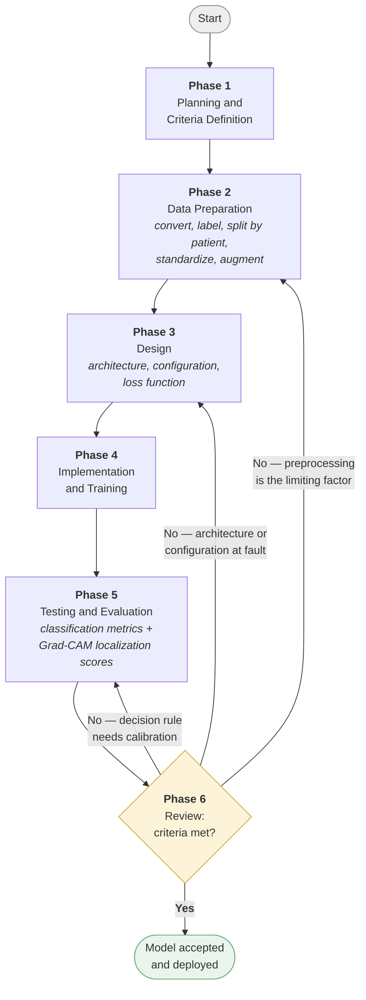
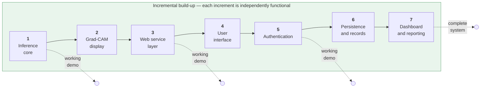
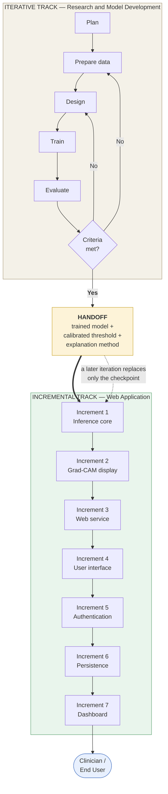

# Software Development Life Cycle (SDLC)

## Selection of the Development Model

The development of the proposed explainable deep learning system follows the **Iterative Model** as its governing framework, supplemented by the **Incremental Model** for the web-based application layer.

The Iterative Model is the appropriate choice because this is **experimental research rather than conventional software construction**. In a typical software project, requirements can be specified in advance and the finished product judged against them. In a deep learning study this is not possible: the achievable accuracy, the resolution the lesions demand, the behavior of the explanation method, and even which network architecture will perform best are **not knowable before they are measured**. Each of these becomes visible only by building a version, evaluating it, and examining what the evaluation reveals. The requirements are therefore discovered through the development process rather than fixed at its start, which is precisely the condition the Iterative Model exists to handle.

The web-based application, by contrast, has requirements that *can* be specified in advance — a user must be able to sign in, upload a mammogram, view a result, and review past scans. These are independent capabilities that can each be built, tested, and delivered in working order before the next is begun, which is the condition the Incremental Model addresses.

| | Research and Model Development | Web Application |
|---|---|---|
| **Model** | Iterative | Incremental |
| **Requirements** | Discovered by measurement | Specifiable in advance |
| **Each cycle produces** | A revised, better-performing model | A new working feature |
| **Cycle ends when** | Evaluation criteria are met | The feature is complete and tested |
| **Direction** | Refines the *same* deliverable repeatedly | Adds *new* pieces to a growing whole |

---

## Part A — Iterative Model: Research and Model Development

### The Iterative Cycle

Each iteration passes through six phases, and the sixth phase decides whether the cycle repeats.

**Phase 1 — Planning and Criteria Definition.** The objective of the iteration is fixed in advance, together with the criterion that will judge it. Defining the criterion *before* running the iteration is essential in this study: a threshold or metric chosen after inspecting results would be reporting the best of many tries rather than an honest measurement.

**Phase 2 — Data Preparation.** Mammography images are converted to a standard format, labeled, paired with their expert lesion outlines, and divided into training, validation, and test subsets grouped by patient. Images are scaled to a fixed canvas with aspect ratio preserved, and training images are augmented. Where an iteration changes the input resolution or the data handling, this phase is re-executed and the image cache is rebuilt.

**Phase 3 — Design.** The network architecture, training configuration, loss function, and any structural change under test for this iteration are specified. All settings not under test are held fixed at their previous values, so that any measured difference can be attributed to the change actually being evaluated.

**Phase 4 — Implementation and Training.** The models are trained under the specified configuration. Where several architectures are compared, all are trained under an identical recipe so that the comparison remains controlled.

**Phase 5 — Testing and Evaluation.** The trained models are evaluated on the held-out test set using accuracy, sensitivity, specificity, F1-score, and AUC-ROC, each reported with a confidence interval. Grad-CAM heatmaps are generated and scored against the expert lesion outlines to measure whether the model's attention falls on clinically relevant tissue.

**Phase 6 — Review and Decision.** Results are examined against the criteria set in Phase 1. If both classification performance and interpretability are acceptable, the iteration is accepted and the model advances. If either falls short, the review identifies *which* phase caused the shortfall — preprocessing, architecture, hyperparameters, or the decision rule — and the next iteration is planned to address that specific cause rather than to change several things at once.

The three distinct return paths matter: the review does not simply say "try again," it identifies which phase to re-enter. An accuracy ceiling caused by input resolution returns the cycle to Phase 2; a poorly performing backbone returns it to Phase 3; a misaligned decision cutoff is corrected within Phase 5 without retraining at all.

---

### Documented Iterations

The study passed through the following iterations, each triggered by a specific finding from the previous evaluation. Four generations of model checkpoints were retained as evidence of this progression.

**Iteration 1 — Baseline establishment.** Initial models were trained on a standard square input canvas to establish that the task was learnable at all and to produce a first performance reading. *Outcome:* a working baseline, and confirmation that the models cleared the majority-class floor.

**Iteration 2 — Data integrity correction.** Review of the dataset's own published train/test partition revealed that the same patients appeared on both sides of the split. Because a single patient contributes multiple images, this would have allowed the model to recognize patients at test time and report inflated accuracy. *Change:* all splits were discarded and rebuilt from scratch using patient-grouped, label-stratified partitioning. *Outcome:* a leak-free evaluation basis, verified by confirming zero patient overlap between every pair of subsets.

**Iteration 3 — Deployability restructuring.** The initial design required an expert lesion crop as input, which a clinician would never possess. *Change:* the two-stage teacher/student design was introduced, in which a crop-fed teacher guides a full-image-only student through knowledge distillation. *Outcome:* a deployable single-input model, later confirmed to lose no detectable accuracy relative to its crop-fed counterpart.

**Iteration 4 — Hyperparameter search.** A six-phase sequential search tuned one axis at a time — learning rate, weight decay, scheduler, augmentation strength, class-imbalance handling, and optimizer — each phase fixing the previous phase's winner before proceeding. *Outcome:* the baseline configuration proved to be at a local optimum, with no phase improving on it. This is a negative result, but a useful one: it established that subsequent performance gains would have to come from the data or the architecture rather than from further tuning.

**Iteration 5 — Input resolution rebuild.** Evaluation of Grad-CAM output revealed that at the original input size, the median lesion measured roughly 19 × 10 pixels — smaller than a single cell of the network's final feature grid. This imposed a hard ceiling on *both* classification accuracy and explanation quality: a lesion smaller than one grid cell cannot be localized even in principle. *Change:* the entire image cache was rebuilt at a larger, non-square resolution matching the median mammogram's proportions, enlarging the median lesion to roughly 35 × 34 pixels. *Outcome:* the study's single largest improvement, and the clearest illustration of why an iterative approach was necessary — this limitation was invisible until Grad-CAM output was examined.

**Iteration 6 — Decision threshold calibration.** Evaluation showed the selected model's sensitivity trailing its specificity, meaning it missed malignancies more readily than it raised false alarms — the wrong balance for screening. *Change:* the decision cutoff was swept across its full range and recalibrated. *Outcome:* sensitivity raised substantially with no retraining and negligible computational cost. This iteration is notable for touching only Phase 5; the model itself was left entirely unmodified.

**Iteration 7 — Explainability evaluation.** Explanations were scored quantitatively against expert lesion outlines across all architectures. *Outcome:* explanations were confirmed to localize well above chance, but the evaluation also revealed that the architecture selected for its classification accuracy produced the *least* faithful explanations of those compared.

**Proposed next iteration.** The finding from Iteration 7 supplies the trigger for a further cycle: re-entering Phase 3 to reselect the architecture under a combined accuracy-and-interpretability criterion rather than accuracy alone. This is documented as a recommendation rather than executed, and it demonstrates the model working as intended — each evaluation generating the specification for the next iteration.

```mermaid
flowchart LR
    I1["<b>1</b><br/>Baseline<br/>established"]
    I2["<b>2</b><br/>Data integrity<br/>corrected"]
    I3["<b>3</b><br/>Deployability<br/>restructured"]
    I4["<b>4</b><br/>Hyperparameters<br/>searched"]
    I5["<b>5</b><br/>Input resolution<br/>rebuilt"]
    I6["<b>6</b><br/>Threshold<br/>calibrated"]
    I7["<b>7</b><br/>Explanations<br/>evaluated"]
    I8["<b>8</b><br/><i>Architecture<br/>reselection</i><br/>(proposed)"]

    I1 -->|"patient leakage<br/>discovered"| I2
    I2 -->|"crop unavailable<br/>at deployment"| I3
    I3 -->|"seeking further<br/>gains"| I4
    I4 -->|"tuning exhausted;<br/>lesions too small"| I5
    I5 -->|"sensitivity below<br/>specificity"| I6
    I6 -->|"are explanations<br/>trustworthy?"| I7
    I7 -.->|"best classifier is<br/>worst explainer"| I8

    style I8 fill:#f4f1e8,stroke:#a89878,stroke-dasharray: 5 3
    style I5 fill:#e9f5ec,stroke:#5aa06e
```

Each arrow is labeled with the finding that triggered the next iteration — none of these were planned at the outset, and each became visible only through evaluation.

---

## Part B — Incremental Model: Web Application Development

The application layer was built as a series of increments, each delivering a complete and independently testable capability. Every increment left the system in a working state, so development could stop at any point with a functioning demonstration.

**Increment 1 — Inference core.** The trained model was wrapped in a callable interface that accepts an image and returns a classification with its probability. Delivered as a minimal local demonstration, this established the deployment path before any user interface existed.

**Increment 2 — Explanation display.** Grad-CAM heatmap generation was added to the inference path, with heatmaps returned at the uploaded image's own resolution and rendered as a color overlay on the mammogram.

**Increment 3 — Web service layer.** The inference core was exposed as a network service so that a browser-based client could reach it, with defined endpoints for analysis and for reporting system status.

**Increment 4 — User interface.** A web application was built providing image upload, result display, and side-by-side comparison of all evaluated architectures.

**Increment 5 — Authentication.** User sign-in was added, with every request scoped to the authenticated user's identity.

**Increment 6 — Persistence and records.** Analyses were persisted to a database so that scan history survives across sessions, with a records view and per-scan detail pages.

**Increment 7 — Dashboard and reporting.** Summary views and record management were added, completing the application.

---

## Part C — How the Two Models Interlock

The two development tracks run largely in parallel and meet at a single handoff point. The iterative track produces a trained model with a calibrated decision threshold; the incremental track consumes it. Because the application performs inference only and never trains, a new iteration of the model can be adopted by the application simply by replacing the checkpoint it loads — the two tracks remain decoupled.

---

## Verification and Validation Activities by Phase

Because an error in an early phase silently corrupts every result that follows, verification is embedded in each phase rather than deferred to the end.

| Phase | Verification activity | What it prevents |
|---|---|---|
| Data Preparation | Patient-overlap check across all split pairs | Inflated accuracy from data leakage |
| Data Preparation | Discard records with unresolvable lesion outlines | Corrupted explanation scores |
| Design | Feature-map shape assertions per architecture | Silent architecture misconfiguration |
| Training | Fixed random seed across all libraries | Irreproducible results |
| Evaluation | Confidence intervals on every headline metric | Overstating the certainty of a ranking |
| Evaluation | Untrained-model control for localization scores | Mistaking dataset geometry for learned behavior |
| Evaluation | Geometric round-trip and spatial-correspondence tests | Undetected errors in heatmap mapping |
| Threshold calibration | Weight-integrity verification against source model | Attributing a metric change to the wrong cause |
| Review | Criteria fixed before the iteration is run | Reporting the best of many tries |

---

## Summary

The study adopts the **Iterative Model** for its research and model development component because the target performance, the required input resolution, the best-performing architecture, and the behavior of the explanation method could not be specified in advance — each was discovered by building a version and measuring it. Seven iterations were completed, each triggered by a specific finding from the preceding evaluation, with the most consequential change (rebuilding the input resolution) arising from a limitation that was invisible until Grad-CAM output was examined. The **Incremental Model** governs the web application, whose requirements were specifiable at the outset and which was built as a sequence of independently functional capabilities. The two tracks meet at a single handoff — a trained model with its calibrated threshold — and remain otherwise decoupled, so that any future iteration can be deployed by replacing that artifact alone.
