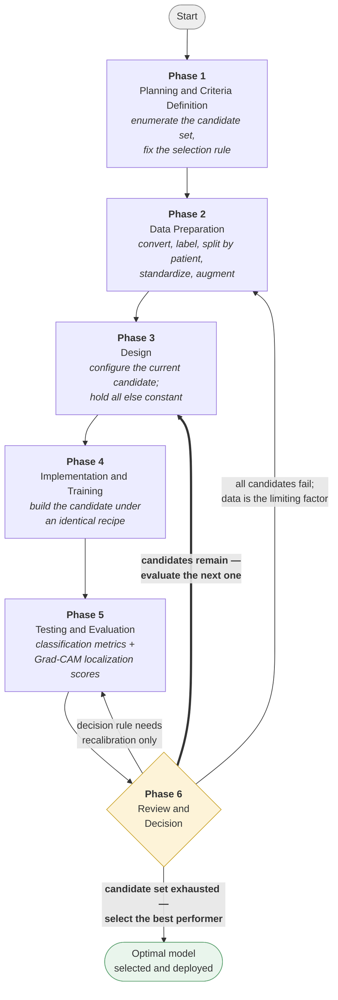

# SDLC (Software Development Life Cycle)

## Selection of the Development Model

The development of the proposed explainable deep learning system follows the **Iterative Model** as its governing framework.

The Iterative Model is the appropriate choice because this is **experimental research rather than conventional software construction**. In a typical software project, requirements can be specified in advance and the finished product judged against them. In a deep learning study this is not possible: the achievable accuracy, the resolution the lesions demand, the behavior of the explanation method, and even which network architecture will perform best are **not knowable before they are measured**. Each of these becomes visible only by building a version, evaluating it, and examining what the evaluation reveals. The requirements are therefore discovered through the development process rather than fixed at its start, which is precisely the condition the Iterative Model exists to handle.

In this study the iteration takes a specific form: **the build-and-measure cycle is repeated across a defined set of candidates, and the optimal candidate is selected from the measured results.** The candidates differ from one experiment to the next — four network architectures in Experiment 1, one hundred ninety-eight decision thresholds in Experiment 2, and four sets of visual explanations in Experiment 3 — but the procedure is identical in each case: one candidate is configured, evaluated under conditions held constant, and recorded; the cycle then repeats with the next candidate; and when the candidate set is exhausted, the best-performing option is selected by a rule fixed in advance. No candidate is dismissed on assumption, and none is chosen by inspection. This exhaustive, systematic sweep is what makes the selection defensible rather than arbitrary.

---

## The Iterative Cycle

Each iteration passes through six phases, and the sixth phase decides whether the cycle repeats.

**Phase 1: Planning and Criteria Definition.** The candidate set to be swept is enumerated and the criterion that will rank its members is fixed in advance. Defining the criterion before running the sweep is essential in this study: a threshold or metric chosen after inspecting results would be reporting the best of many tries rather than an honest measurement.

**Phase 2: Data Preparation.** Mammography images are converted to a standard format, labeled, paired with their expert lesion outlines, and divided into training, validation, and test subsets grouped by patient. Images are scaled to a fixed canvas with aspect ratio preserved, and training images are augmented. Where an iteration changes the input resolution or the data handling, this phase is re-executed and the image cache is rebuilt.

**Phase 3: Design.** The current candidate is specified — the network architecture, training configuration, loss function, or decision rule under evaluation in this pass of the cycle. All settings not under test are held fixed at their previous values, so that any measured difference can be attributed to the candidate actually being evaluated rather than to an incidental change.

**Phase 4: Implementation and Training.** The candidate is built and trained under the specified configuration. Where several architectures are compared, all are trained under an identical recipe so that the comparison remains controlled.

**Phase 5: Testing and Evaluation.** The candidate is evaluated on the held-out test set using accuracy, sensitivity, specificity, F1-score, and AUC-ROC, each reported with a confidence interval. Grad-CAM heatmaps are generated and scored against the expert lesion outlines to measure whether the model's attention falls on clinically relevant tissue. The result is recorded alongside those of every candidate already evaluated.

**Phase 6: Review and Decision.** The recorded results are examined against the criteria set in Phase 1. If candidates remain unevaluated, the cycle returns to Phase 3 and the next one is configured. Once the candidate set is exhausted, the best performer is selected by the pre-defined rule and advances. If the entire set fails to meet the acceptance criteria, the review identifies which phase caused the shortfall — preprocessing, architecture, hyperparameters, or the decision rule — and a new sweep is planned to address that specific cause rather than changing several things at once.

The **return paths are distinct, and which one is taken carries meaning.** The ordinary path returns to Phase 3 to configure the next candidate in the sweep; this is the loop that drives each experiment to completion. A shortfall traced to input resolution or data handling returns the cycle to Phase 2 and forces the image cache to be rebuilt. A shortfall traced only to the decision rule is corrected within Phase 5 itself, without retraining anything at all — the model's weights, its predictions, and its ROC curve are all left untouched while only the cutoff moves.

**Figure 2. SDLC for Model Training**

The heavy arrow from Phase 6 back to Phase 3 is the sweep loop, and it is the path taken most often — it carries the cycle through every candidate in turn before any selection is made.

---

## Application of the Cycle to the Three Experiments

The same six-phase cycle governs all three experiments; only the candidate set and the selection rule change.

**Experiment 1 — Architecture selection.** The candidate set is four pretrained network architectures. Each is trained as a full pass through Phases 3 to 5 under a configuration held identical in every respect — same input size, batch size, learning-rate schedule, random seed, and stopping rule — because holding everything constant except the network itself is what licenses attributing the observed differences to the architecture. After all four have been trained and evaluated, the best performer on accuracy and AUC-ROC is selected as the baseline architecture. This is the most expensive sweep in the study, each pass costing a substantial amount of GPU time.

**Experiment 2 — Decision threshold optimization.** The candidate set is one hundred ninety-eight decision cutoffs spanning the full probability range. Each is applied to the predictions already saved in Experiment 1, and accuracy, sensitivity, specificity, and F1-score are recomputed at every cutoff. Because the model is never retrained and no new inference is performed, each pass through the loop costs almost nothing, and the entire sweep completes in seconds. The optimal cutoff is then selected by a rule fixed in advance rather than by inspecting the curve — one cutoff defined structurally as the smallest change that reverses the sensitivity/specificity imbalance, and one chosen to maximize correct classification among cutoffs that favor sensitivity.

**Experiment 3 — Explainability comparison.** The candidate set is the visual explanations produced by all four architectures. Grad-CAM heatmaps are generated for every test image under each model and scored against the expert lesion outlines using overlap agreement, pointing accuracy, and attention concentration. A secondary sweep over nineteen binarization thresholds confirms that the resulting ranking is a property of the models rather than an artifact of a single threshold choice. The most interpretable architecture is then identified by paired statistical comparison across all pairs.

| Experiment | Candidate set | Size | Selection rule | Cost per pass |
|---|---|---|---|---|
| 1 — Architecture | Pretrained network architectures | 4 | Highest accuracy and AUC-ROC | Hours of GPU time |
| 2 — Threshold | Decision cutoffs from 0.01 to 0.995 | 198 | Fixed rules favoring sensitivity | Milliseconds, CPU only |
| 3 — Explainability | Sets of Grad-CAM explanations | 4 (× 19 thresholds) | Best localization against expert outlines | Minutes of GPU time |

---

## Summary

The study adopts the Iterative Model for its research and model development component because the target performance, the best-performing architecture, the optimal decision threshold, and the behavior of the explanation method could not be specified in advance — each was discovered by building a candidate and measuring it. In every experiment the cycle was driven to completion over a defined candidate set rather than stopped at the first acceptable result: four architectures were trained and compared under an identical recipe, one hundred ninety-eight decision thresholds were swept exhaustively, and four sets of explanations were scored against expert annotations. In each case the optimum was selected by a rule fixed before the sweep began. This systematic, exhaustive approach is what allows the study to claim that the chosen architecture, the chosen threshold, and the reported interpretability ranking are the best available options within the space examined, rather than merely the first configurations that happened to work.
