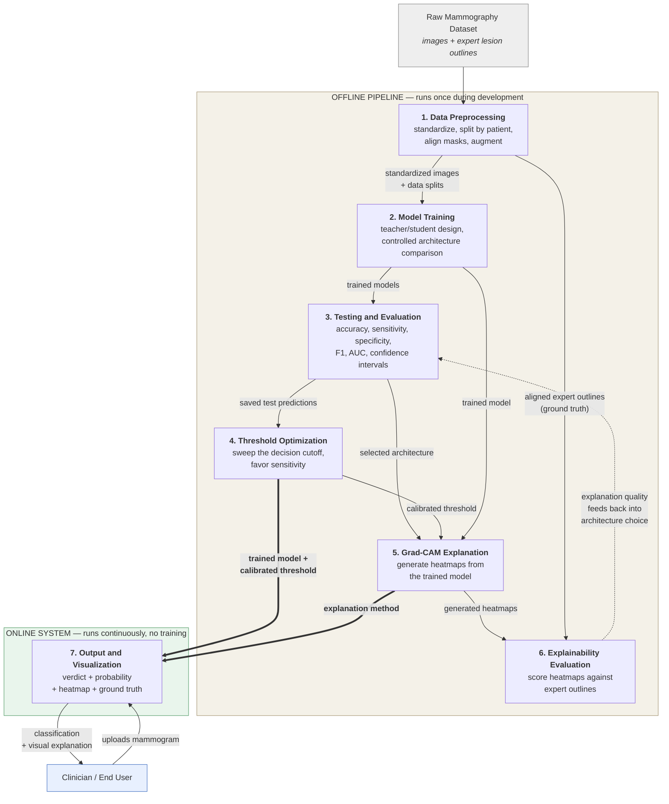

# System Modules

The proposed system is designed as an end-to-end explainable deep learning pipeline for breast cancer detection in mammography. The overall design consists of seven interconnected modules, each responsible for one stage of the process that turns a raw mammogram into a classified, explained, and verifiable result:

1. Data Preprocessing Module
2. Model Training Module
3. Model Testing and Evaluation Module
4. Threshold Optimization Module
5. Grad-CAM Explanation Module
6. Explainability Evaluation Module
7. Output and Visualization Module

The modules operate in two distinct regimes. The first six form an **offline pipeline** that runs once during development: data is prepared, models are trained, performance is measured, the decision rule is calibrated, and explanations are validated. The seventh forms an **online system** that serves the finished model to a user and performs no training of its own. What passes between the two regimes is a single trained model together with its calibrated decision threshold and the method for explaining its predictions.

---

## 1. Data Preprocessing Module

This module transforms the raw mammography dataset into a consistent, leak-free, model-ready form. Medical-format images are converted to a standard image format and the dataset's diagnostic categories are collapsed into a binary target of benign or malignant, while each lesion's expert segmentation mask is identified and paired with its mammogram — records whose mask cannot be resolved unambiguously are discarded rather than guessed at, since a mismatched mask would silently corrupt every explanation score computed later. The dataset is then divided into training, validation, and test subsets under the constraint that **all images belonging to one patient stay together in a single subset**, which is the module's most important safeguard: a patient contributes several images, and allowing them to scatter across subsets would let the model recognize a patient at test time and report inflated accuracy. Every mammogram is scaled to fit a fixed canvas while preserving its aspect ratio and centered on a uniform background, with each mammogram and its segmentation mask passing through the *same* geometric transformation so the two remain pixel-aligned — an alignment the explainability evaluation later depends on entirely. Finally, training images are randomly flipped, rotated, and adjusted for brightness to discourage memorization, with geometric transformations applied to image and mask from a single shared random draw so alignment is never broken; validation and test images are never augmented.

---

## 2. Model Training Module

This module produces a classifier that works under real deployment conditions and determines which network architecture does it best. Its design is dictated by a single constraint: the dataset provides expert lesion crops, but a clinician using the finished system will not have one — if they had already located and outlined the lesion, they would not need the model — so any model that *requires* that crop cannot be deployed. Training therefore proceeds in two stages. A **teacher** is first trained on the full mammogram *plus* the expert lesion crop; having effectively been shown where to look it performs well, but it is not deployable, and once trained it is frozen. A **student** is then trained on the full mammogram *alone*, learning not only from the ordinary correct/incorrect signal but also from the teacher's **confidence values** — the teacher does not say "malignant" but "eighty-five percent malignant," which conveys whether a case is textbook or borderline — with its learning objective blending agreement with the true label and agreement with the teacher's confidence in equal measure. The teacher's role is guidance rather than competition; its outputs are computed once in advance and reused unchanged throughout training so that each image's difficulty acts as a fixed property rather than a moving target, and only the student is ever deployed. Several pretrained architectures are each trained as students under a configuration held identical in every respect — same image size, batch size, learning-rate schedule, random seed, and stopping rule — because holding everything constant except the network itself is what licenses the conclusion that observed differences are caused by the architecture rather than by the training setup.

---

## 3. Model Testing and Evaluation Module

This module measures how well each trained model actually classifies and quantifies how confident those measurements are, evaluating each model exactly **once** on the held-out test set that no model has seen during training or tuning. It computes the standard classification metrics — accuracy, sensitivity, specificity, F1-score, and area under the ROC curve — from the confusion matrix of true and false positives and negatives, and accompanies every headline figure with an interval estimate obtained by repeatedly resampling the test set. That interval is essential rather than decorative: with a test set of a few hundred images, two models differing by two or three percentage points may not be meaningfully distinguishable, and reporting a bare number would overstate the certainty of the ranking. Training and validation loss and accuracy are also tracked per epoch and plotted, so that overfitting or underfitting becomes visible rather than assumed. Finally, each deployable single-input model is compared against its own dual-input teacher to quantify what is lost by giving up the expert crop at inference, expressed as an interval on the accuracy difference — an interval spanning zero indicates the loss is too small to detect at this sample size, which is the evidence that validates the deployable design.

---

## 4. Threshold Optimization Module

This module aligns the model's decision rule with the clinical priorities of cancer screening without retraining anything. A classifier outputs a probability, which becomes a decision only once a cutoff is applied, and the conventional cutoff of 0.5 is arbitrary from a clinical standpoint — at that default the model was found to miss malignancies more readily than it raised false alarms, precisely the wrong balance for screening, where a missed cancer is far costlier than an unnecessary follow-up. The module sweeps the cutoff across its full range, recomputing accuracy, sensitivity, specificity, and F1 at each step, and because it reuses the predictions already saved by the testing module, **no retraining and no new inference occur** — the entire analysis is computationally trivial and can be repeated whenever deployment priorities change. Candidate operating points are identified by fixed rules rather than by manual inspection: a conservative cutoff defined structurally as the smallest change that reverses the sensitivity/specificity imbalance, and a high-sensitivity cutoff chosen to maximize correct classification among cutoffs that favor sensitivity. Critically, changing the cutoff does not change the model — the underlying weights, the probabilities, and the area under the ROC curve are all untouched, and only the point at which a probability becomes a verdict moves — which makes the adjustment fully reversible and independently auditable.

---

## 5. Grad-CAM Explanation Module

This module makes each prediction inspectable by showing which regions of the mammogram drove it, since a prediction alone is not clinically actionable — a radiologist must be able to see *why*. The network's final convolutional layer holds a spatial map of learned features, and the module asks which locations in that map, if their activation increased, would most raise the malignancy score; it answers by tracing the malignancy score backward to that feature map, weighting each feature channel by its influence, combining the channels into a single map, and discarding everything that would *lower* the score so that only positive evidence is displayed. Two design choices govern the result. First, the heatmap is always computed with respect to the malignant class for every image, including benign ones, because otherwise a benign case would produce a map of "what looks benign," which is a different and less useful question than "does anything here look malignant." Second, because the model internally works on a standardized canvas, the heatmap is mapped back through that transformation and returned at the resolution of the image the user actually supplied, so it can be overlaid directly on their own mammogram. The finished heatmap is blended over the original image using a warm-to-cool color scale, with warmer regions marking higher influence.

---

## 6. Explainability Evaluation Module

This module determines whether the explanations are *correct*, not merely present — a necessity because a heatmap always looks plausible, and warm regions on a mammogram will appear meaningful to a viewer whether or not they correspond to anything real. Since the dataset already contains expert-drawn lesion outlines, this can be checked **quantitatively rather than by visual impression**, and without recruiting expert reviewers. For each test image the generated heatmap is compared against the radiologist's outline along three lines: overlap agreement, or how much the region the heatmap claims coincides with the true lesion; pointing accuracy, or whether the single hottest point of the heatmap falls inside the lesion at all, which is the most intuitive measure and requires no threshold choice; and attention concentration, or what proportion of the heatmap's total intensity falls on the lesion relative to what a heatmap ignoring the image entirely would achieve by area alone. Because a lesion occupies a very small fraction of a mammogram and the heatmap's resolution is inherently coarse — it cannot draw a region smaller than one cell of the feature map — overlap scores are low in absolute terms for geometric reasons, and every metric is therefore interpreted **relative to what chance alone would produce** rather than against perfection. Before any score is accepted the module validates its own machinery by scoring an untrained network to establish the chance floor, round-trip testing the geometric mapping, verifying spatial correspondence against a synthetic case with a known answer, and reporting the proportion of heatmap peaks landing on blank background as a fraud check, since a metric that scored well for an untrained model would be measuring the dataset rather than the model. Because every architecture is evaluated on the same images in the same order, explanation quality can then be compared using paired statistical tests with correction applied for the number of comparisons made.

---

## 7. Output and Visualization Module

This module delivers the classification and its explanation to the end user, loading the trained model together with its calibrated threshold and performing inference only. For each mammogram submitted it presents the binary verdict of Benign or Malignant, the predicted probability of malignancy alongside a confidence figure, the Grad-CAM heatmap overlaid on the original mammogram, and — for images drawn from the annotated dataset — the expert lesion outline shown beside it, so that the model's attention can be compared directly against ground truth. Results from all evaluated architectures are displayed together rather than only the selected one, letting the user see where the models agree and where they diverge, and analyses are stored so that a user's history persists across sessions.

---

## Module Interaction Graph

**Reading the graph.** Solid arrows carry data or artifacts forward. The dotted arrow from Module 6 back to Module 3 marks the study's key feedback relationship: explanation quality is a second selection criterion that can revise a choice made on accuracy alone. The two heavy arrows are the handoff from development to deployment — the only things that cross into the running system are a trained model, its calibrated threshold, and the method for explaining its predictions.

---

## Summary of Module Inputs and Outputs

| Module | Takes in | Produces |
|---|---|---|
| 1. Data Preprocessing | Raw images and expert annotations | Standardized images, patient-separated splits, aligned masks |
| 2. Model Training | Preprocessed training and validation data | Trained deployable models, one per architecture |
| 3. Testing and Evaluation | Trained models, held-out test set | Performance metrics with confidence intervals; selected architecture |
| 4. Threshold Optimization | Saved test predictions | A calibrated decision threshold favoring sensitivity |
| 5. Grad-CAM Explanation | Trained model, an input mammogram | A heatmap at the original image resolution |
| 6. Explainability Evaluation | Heatmaps, expert lesion outlines | Explanation-quality metrics per architecture |
| 7. Output and Visualization | Model, threshold, explanation method, user upload | Verdict, probability, heatmap, ground-truth comparison |
