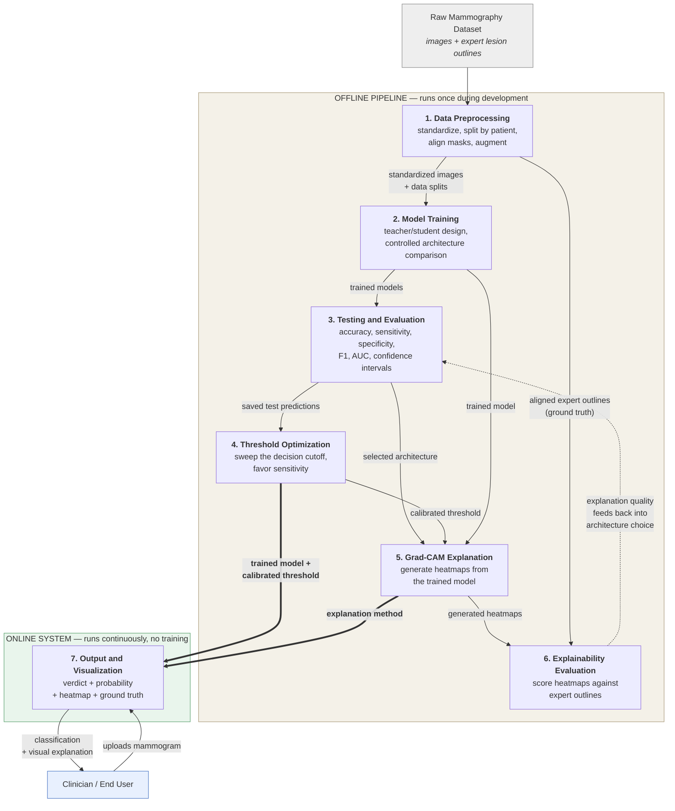

# System Modules

The proposed system is designed as an end-to-end explainable deep learning pipeline for breast cancer detection in mammography. The overall design consists of seven interconnected modules, each responsible for one stage of the process that turns a raw mammogram into a classified, explained, and verifiable result:

1. Data Preprocessing Module
2. Model Training Module
3. Model Testing and Evaluation Module
4. Threshold Optimization Module
5. Grad-CAM Explanation Module
6. Explainability Evaluation Module
7. Output and Visualization Module

The modules operate in two distinct regimes. The first six form an **offline pipeline** that runs once during development: data is prepared, models are trained, performance is measured, the decision rule is calibrated, and explanations are validated. The seventh forms an **online system** that serves the finished model to a user and performs no training of its own. What passes between the two regimes is a single trained model together with its calibrated decision threshold.

---

## 1. Data Preprocessing Module

**Purpose.** To transform the raw mammography dataset into a consistent, leak-free, model-ready form.

Raw mammograms arrive at wildly varying resolutions and are accompanied by expert annotations: a cropped view of each lesion and a segmentation mask outlining its exact boundary. This module standardizes all of it.

**Key operations.**

- **Format conversion and labeling.** Medical-format images are converted to a standard image format, and the dataset's diagnostic categories are collapsed into a binary target: benign or malignant.
- **Annotation resolution.** Each lesion's segmentation mask is identified and paired with its mammogram. Where a mask cannot be resolved unambiguously, the record is discarded rather than guessed at — a mismatched mask would silently corrupt every explanation score computed later.
- **Patient-grouped splitting.** The dataset is divided into training, validation, and test subsets such that **all images belonging to one patient stay together in a single subset**. This is the module's most important safeguard: a patient contributes several images, and allowing them to scatter across subsets would let the model recognize a patient at test time and report inflated accuracy.
- **Geometric standardization.** Every mammogram is scaled to fit a fixed canvas while preserving its aspect ratio, then centered on a uniform background. Crucially, each mammogram and its segmentation mask pass through the *same* geometric transformation, so the two remain pixel-aligned — an alignment the explainability evaluation later depends on entirely.
- **Augmentation.** Training images are randomly flipped, rotated, and adjusted for brightness to discourage memorization. Geometric transformations are applied to the image and its mask from a single shared random draw so alignment is never broken. Validation and test images are never augmented.

**Output.** A standardized image cache and three disjoint, class-balanced, patient-separated subsets.

---

## 2. Model Training Module

**Purpose.** To produce a classifier that works under real deployment conditions, and to determine which network architecture does it best.

**The deployment constraint that shapes the design.** The dataset provides expert lesion crops, but a clinician using the finished system will not have one — if they had already located and outlined the lesion, they would not need the model. Any model that *requires* that crop cannot be deployed. This module therefore trains in two stages.

- **Stage one — the teacher.** A model is trained on the full mammogram *plus* the expert lesion crop. Having effectively been shown where to look, it performs well, but it is not deployable. Once trained, it is frozen.
- **Stage two — the student.** A second model is trained on the full mammogram *alone*. Beyond the ordinary correct/incorrect signal, it also learns from the teacher's **confidence values** — the teacher does not say "malignant" but "eighty-five percent malignant," which conveys whether a case is textbook or borderline. The student's learning objective blends agreement with the true label and agreement with the teacher's confidence in equal measure.

The teacher's role is **guidance, not competition**. Its outputs are computed once in advance and reused unchanged throughout training, so each image's difficulty acts as a fixed property rather than a moving target. Only the student is ever deployed.

**Controlled architecture comparison.** Several pretrained network architectures are each trained as students under a configuration held identical in every respect — same image size, same batch size, same learning-rate schedule, same random seed, same stopping rule. Holding everything constant except the network itself is what licenses the conclusion that observed differences are caused by the architecture rather than by the training setup.

**Output.** One trained deployable model per architecture, plus the saved predictions each produced on the test set.

---

## 3. Model Testing and Evaluation Module

**Purpose.** To measure how well each trained model actually classifies, and to quantify how confident those measurements are.

Each model is evaluated **once** on the held-out test set — data no model has seen during training or tuning.

**What is measured.**

- **Classification metrics** — accuracy, sensitivity, specificity, F1-score, and area under the ROC curve, computed from the confusion matrix of true and false positives and negatives.
- **Confidence intervals.** Every headline figure is accompanied by an interval estimate obtained by repeatedly resampling the test set. This is essential rather than decorative: with a test set of a few hundred images, two models differing by two or three percentage points may not be meaningfully distinguishable, and reporting a bare number would overstate the certainty of the ranking.
- **Convergence diagnostics.** Training and validation loss and accuracy are tracked per epoch and plotted, so that overfitting or underfitting is visible rather than assumed.
- **Deployment cost.** Each deployable single-input model is compared against its own dual-input teacher to quantify what is lost by giving up the expert crop at inference. The comparison is expressed as an interval on the accuracy difference; an interval spanning zero indicates the loss is too small to detect at this sample size.

**Output.** A performance profile per architecture, and the selection of one architecture to carry forward.

---

## 4. Threshold Optimization Module

**Purpose.** To align the model's decision rule with the clinical priorities of cancer screening, without retraining.

**The problem it solves.** A classifier outputs a probability, which becomes a decision only once a cutoff is applied. The conventional cutoff of 0.5 is arbitrary from a clinical standpoint, and at that default the model was found to miss malignancies more readily than it raised false alarms — precisely the wrong balance for screening, where a missed cancer is far costlier than an unnecessary follow-up.

**How it works.** The module sweeps the cutoff across its full range, recomputing accuracy, sensitivity, specificity, and F1 at each step. Because it reuses the predictions already saved by the testing module, **no retraining and no new inference occur** — the entire analysis is computationally trivial and can be repeated whenever deployment priorities change.

Candidate operating points are then identified by fixed rules rather than by manual inspection:

- A **conservative** cutoff, defined structurally as the smallest change that reverses the sensitivity/specificity imbalance.
- A **high-sensitivity** cutoff, chosen to maximize correct classification among cutoffs that favor sensitivity.

**An important property.** Changing the cutoff does not change the model. The underlying weights, the probabilities, and the area under the ROC curve are all untouched; only the point at which a probability becomes a verdict moves. This makes the adjustment fully reversible and independently auditable.

**Output.** A calibrated decision threshold, packaged together with the trained model.

---

## 5. Grad-CAM Explanation Module

**Purpose.** To make each prediction inspectable by showing which regions of the mammogram drove it.

**The concept.** A prediction alone is not clinically actionable — a radiologist must be able to see *why*. This module produces a heatmap over the mammogram indicating the regions that most influenced the malignancy score.

**How it works, in principle.** The network's final convolutional layer holds a spatial map of learned features. The module asks: *which locations in that map, if their activation increased, would most raise the malignancy score?* It answers by tracing the malignancy score backward to that feature map, weighting each feature channel by its influence, combining the channels into a single map, and discarding everything that would *lower* the score so only positive evidence is displayed.

**Two design choices worth stating.**

- **The explanation always answers the same question.** The heatmap is computed with respect to the malignant class for every image, including benign ones. Otherwise a benign case would produce a map of "what looks benign," which is a different and less useful question than "does anything here look malignant."
- **The explanation is returned at the user's own image resolution.** Because the model internally works on a standardized canvas, the heatmap must be mapped back through that transformation and returned at the size of the image the user actually supplied, so it can be overlaid directly on their mammogram.

The finished heatmap is blended over the original image using a warm-to-cool color scale, with warmer regions marking higher influence.

**Output.** A visual explanation accompanying every prediction.

---

## 6. Explainability Evaluation Module

**Purpose.** To determine whether the explanations are *correct*, not merely present.

**Why this module exists.** A heatmap always looks plausible. Warm regions on a mammogram will appear meaningful to a viewer whether or not they correspond to anything real. The only way to know whether an explanation is trustworthy is to check it against ground truth — and because the dataset already contains expert-drawn lesion outlines, this can be done **quantitatively rather than by visual impression**, and without recruiting expert reviewers.

**What is measured.** For each test image, the generated heatmap is compared against the radiologist's lesion outline:

- **Overlap agreement** — after converting the continuous heatmap to a definite claimed region, how much does that region coincide with the true lesion?
- **Pointing accuracy** — does the single hottest point of the heatmap fall inside the lesion at all? This is the most intuitive measure and requires no threshold choice.
- **Attention concentration** — what proportion of the heatmap's total intensity falls on the lesion, relative to what a heatmap ignoring the image entirely would achieve by area alone?

**Interpreting against a floor, not against perfection.** A lesion occupies a very small fraction of a mammogram, and the heatmap's resolution is inherently coarse — it cannot draw a region smaller than one cell of the feature map. Overlap scores are therefore low in absolute terms for geometric reasons, and every metric is interpreted **relative to what chance alone would produce**.

**Validating the measuring instrument.** Before any score is accepted, the module verifies its own machinery: an untrained network is scored to establish the chance floor, the geometric mapping is round-trip tested, spatial correspondence is verified against a synthetic case with a known answer, and the proportion of heatmap peaks landing on blank background is reported as a fraud check. A metric that scored well for an untrained model would be measuring the dataset, not the model.

**Architecture comparison.** Because every architecture is evaluated on the same images in the same order, explanation quality can be compared using paired statistical tests, with correction applied for the number of comparisons made.

**Output.** A per-architecture explanation-quality profile, reported alongside the classification profile from Module 3 — allowing the two to be weighed against each other.

---

## 7. Output and Visualization Module

**Purpose.** To deliver the classification and its explanation to the end user.

This module loads the trained model and its calibrated threshold and performs inference only. For each mammogram submitted, it presents:

- the **binary verdict** — Benign or Malignant,
- the **predicted probability** of malignancy and a confidence figure,
- the **Grad-CAM heatmap** overlaid on the original mammogram,
- and, for images drawn from the annotated dataset, the **expert lesion outline** alongside it, so the model's attention can be compared directly against ground truth.

Results from all evaluated architectures are shown together rather than only the selected one, letting the user see where the models agree and where they diverge. Analyses are stored so that a user's history persists across sessions.

**Output.** An interpretable, reviewable decision-support result.

---

## Module Interaction Graph

**Reading the graph.** Solid arrows carry data or artifacts forward. The dotted arrow from Module 6 back to Module 3 marks the study's key feedback relationship: explanation quality is a second selection criterion that can revise a choice made on accuracy alone. The two heavy arrows are the handoff from development to deployment — the only things that cross into the running system are a trained model, its calibrated threshold, and the method for explaining its predictions.

---

## Summary of Module Inputs and Outputs

| Module | Takes in | Produces |
|---|---|---|
| 1. Data Preprocessing | Raw images and expert annotations | Standardized images, patient-separated splits, aligned masks |
| 2. Model Training | Preprocessed training and validation data | Trained deployable models, one per architecture |
| 3. Testing and Evaluation | Trained models, held-out test set | Performance metrics with confidence intervals; selected architecture |
| 4. Threshold Optimization | Saved test predictions | A calibrated decision threshold favoring sensitivity |
| 5. Grad-CAM Explanation | Trained model, an input mammogram | A heatmap at the original image resolution |
| 6. Explainability Evaluation | Heatmaps, expert lesion outlines | Explanation-quality metrics per architecture |
| 7. Output and Visualization | Model, threshold, explanation method, user upload | Verdict, probability, heatmap, ground-truth comparison |
